<p align="center">
  <picture>
    <source media="(prefers-color-scheme: dark)"  srcset="docs/assets/vayupress-logo-light.png">
    <source media="(prefers-color-scheme: light)" srcset="docs/assets/vayupress-logo.png">
    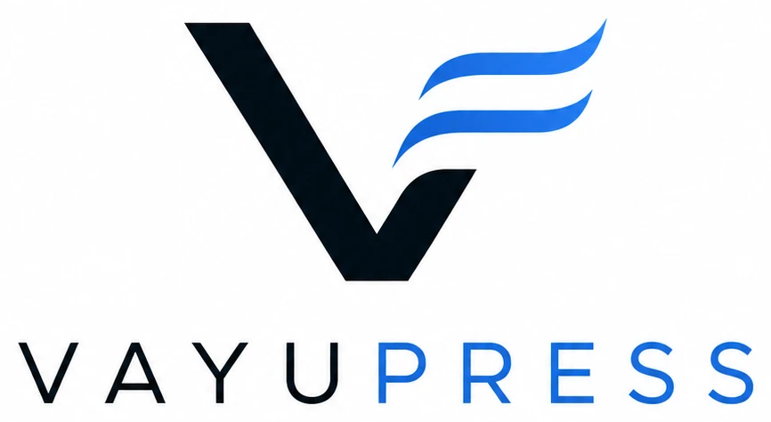
  </picture>
</p>

# VayuPress

[](https://github.com/johalputt/vayupress/actions/workflows/ci.yml)
[](https://github.com/johalputt/vayupress/actions/workflows/security.yml)
[](https://go.dev/)
[](LICENSE)
[](GOVERNANCE-CONSTITUTION.md)

> **Adaptive publishing infrastructure for the sovereign web.**
> SQLite-first, zero-trust, zero telemetry. Policy-governed runtime with adaptive system modes, sandboxed plugins, transactional event outbox, durable audit trail, and fault-tolerant federated publishing.
>
> **Complete digital sovereignty in one binary.**
> _Own your content. Own your communication. Own your infrastructure._
> Publishing is the core identity, **VayuMail** the native sovereignty layer, **VayuPGP** the native privacy layer, and **VayuOS** the native control layer — all in a single Go binary, single process, single config.

## What's New in v2.0.0

> Full notes in [`CHANGELOG.md`](CHANGELOG.md) · architecture decision in
> [`docs/adr/ADR-0092`](docs/adr/ADR-0092-block-editor-v2-and-low-impact-deploys.md)

**The sovereign-publishing 2.0 release — a ground-up editor overhaul, an
in-house way to get paid, and updates that no longer wobble the server.**

- **A best-in-class block editor.** The writing canvas now scrolls smoothly, and
  the toolbar gains **one-click HTML source mode** (lossless visual ↔ HTML
  round-trip), an **image gallery** card (up to 9 images), **HTML** and
  **Markdown** cards (sanitised on save), image **captions** and **width**
  (regular / wide / full), and **auto-bookmarking** when you paste a URL.
- **A full Post settings panel (publishing options).** Feature image, post
  URL/slug (with safe rename), publish date, custom excerpt, a tag editor, SEO
  meta title + description, canonical URL, Open Graph / Twitter social cards, and
  **Feature this post** / **Turn into a page** toggles — all flowing into the
  rendered `<head>`, social cards, and JSON-LD.
- **Monetization — get paid without surrendering sovereignty.** A dependency-free
  **direct/offline payments** gateway with a sovereign order ledger, a generic
  **signed-webhook** path for any external processor (no card data, no SDK),
  payer receipt emails, a JS-free public `/checkout`, and an operator-managed
  **advertising** console (house image ads, sanitised HTML creatives, optional
  Google AdSense) — everything off by default.
- **Major security hardening.** A single rebind-safe outbound dialer
  (`internal/safefetch`), spoof-resistant client-IP resolution, Argon2id raised
  to OWASP `t=3`, and a `SameSite=Strict` admin cookie.
- **Buttery-smooth updates.** The HTTP listener no longer blocks on Meilisearch
  at startup, post-deploy cache-warm and search reindex are paced, and the
  updater builds at idle priority with a disk preflight and an automatic
  pre-update DB snapshot.

## What's New in v1.19.0

> Full notes in [`CHANGELOG.md`](CHANGELOG.md)

**A complete Newsletter console — the *Newsletter* tab now opens a real dashboard.**

- **Audience health at a glance** — total / active / pending double-opt-in /
  unsubscribed counts, 30-day new signups, a confirmation rate, and a
  dependency-free growth sparkline.
- **Subscriber management** — searchable table with status-segment tabs,
  per-row delete (GDPR / spam cleanup), and one-click CSV export.
- **Broadcast composer** — subject + plain text + optional HTML, a **send-test**
  action, and a one-click send to every confirmed subscriber (with an automatic
  unsubscribe link on every message).
- **Persisted broadcast history** — every send is recorded with its audience
  size and sent/failed tallies for real delivery insight.
- **SMTP-aware** — the console clearly flags when SMTP isn't configured and
  guards the send actions accordingly.

## What's New in v1.18.0

> Full notes in [`CHANGELOG.md`](CHANGELOG.md)

**Update & Backup — update VayuPress and back up your whole site in one click,
from VayuOS.** A new **Update & Backup** page (under *System*) finally brings two
shell-only chores into the admin panel. See ADR-0089.

- **One-click software updates — no command line, nothing left half-done.** Check
  for the latest signed release and install it in a single click: the download is
  verified by SHA-256 checksum **and** Ed25519 signature against the pinned
  release key, your database is backed up automatically, the binary is swapped
  atomically, and the service re-launches itself to activate the new version. A
  **Roll back** button restores the previous binary and restarts.
- **Full backup, export & import — with no size limit.** Download your entire
  site — the database and every setting — as one consistent, checksummed
  `.tar.gz`, and restore it on this or another server. The database is copied
  with SQLite `VACUUM INTO` for a clean point-in-time snapshot; export and import
  stream in constant memory with the request timeouts lifted, so multi-gigabyte
  sites move without trouble. A restore validates the archive, backs up the
  current database first, then swaps the restored data in atomically at startup.
- **Same security contract as the CLI updater (ADR-0064).** One-click apply still
  requires the operator opt-in (`VAYU_SELFUPDATE_ENABLED=true`) and a pinned
  release key (`VAYU_RELEASE_PUBKEY`), refuses in unsafe modes, and verifies
  signatures before writing anything. Every action is admin-gated,
  CSRF-protected, and recorded in the update history and the WORM audit log.

## What's New in v1.17.0

> Full notes in [`CHANGELOG.md`](CHANGELOG.md)

**API Keys console — manage every credential from VayuOS.**

- **Issue, rotate and revoke API keys from the admin panel.** Mint as many
  labelled keys as you need (deploy bot, CI, integrations) and rotate or revoke
  any of them instantly — no restart. Only a SHA-256 hash is stored; the full
  key is shown once at creation. The `API_KEY` env value still works as a
  bootstrap credential. See ADR-0088.
- **Encrypted third-party credentials.** Store the secrets VayuPress uses to
  reach other services, **AES-256-GCM encrypted at rest** and shown only as a
  masked hint. First-class cards for **IndexNow** (set the key in the UI — the
  `/.well-known/<key>.txt` verification file is now served automatically),
  **OpenRouter**, **Local AI (Ollama)**, **n8n**, plus a **custom** option for
  anything else.
- **Rotation is 100% automated.** Secrets are encrypted with a persistent
  keyring key that is decoupled from your API keys, so rotating a key never
  requires re-entering a stored secret. A dedicated **System** key is
  auto-provisioned for internal use and propagates to internal consumers live on
  rotation — zero configuration.

## What's New in v1.16.0

> Full notes in [`CHANGELOG.md`](CHANGELOG.md)

**Subscription Engine v2 — the Members tab is now a full revenue cockpit.**

- **A real subscription dashboard.** Opening Members now leads with eight live
  metrics: Monthly Recurring Revenue (with a 30-day net-movement trend), annual
  run-rate, paid members (and how many are trialing), total members and 30-day
  signups, free-to-paid **conversion rate**, 30-day **churn rate**, **ARPU**, and
  estimated **lifetime value (LTV)**. See ADR-0087.
- **Growth & revenue charts** — a dependency-free SVG sparkline of daily signups
  plus a revenue-by-tier breakdown, right on the dashboard.
- **Member activity feed** — signups, subscriptions, trials, upgrades,
  cancellations, comps and failed payments stream into a per-member timeline and
  a site-wide recent-activity feed.
- **Free trials & graceful cancellations** — grant an N-day trial per tier (no
  MRR until it converts) and cancel members at period end instead of instantly.
- **One-click CSV export** of your whole audience, plus an instant **member
  search** over email, name and labels.
- **Optional Stripe price IDs per tier** and a richer webhook that reconciles
  scheduled cancels, deletions and failed payments — still with no embedded
  payment SDK.

## What's New in v1.15.0

> Full notes in [`CHANGELOG.md`](CHANGELOG.md)

**A Theme Studio overhaul *and* a complete premium membership system.**

- **Themes restyle your whole blog, not just the colours.** All nine built-in
  design themes (Gale, Zephyr, Dispatch, Vivid, Beacon, Ripple, Maverick, Agora,
  Apex) now style the real public markup across every section — nav, hero, post
  cards, article pages, author box, related posts, comments, and a multi-column
  footer — so switching themes transforms the entire site. Colour presets each
  carry a layout archetype (Minimal / Classic / Magazine / Editorial / Bold) so
  even a palette swap changes structure and spacing. See ADR-0086.
- **One place for design.** Logo, brand colours, layout, fonts, hero, article
  options and the social/OG share image are all edited in the Theme Studio with
  a live preview; the homepage hero is now opt-in for a clean, post-first home.
- **Priced subscription tiers** — define named plans with monthly/yearly pricing
  and a benefit list. Free and Premium ship seeded; add, edit, hide, or archive
  more from the Members console.
- **Public pricing page (`/pricing`)** — a themed plan grid built from your
  published tiers, plus a JSON catalogue at `GET /api/v1/tiers`.
- **Member portal (`/members/account`)** — signed-in readers see their plan,
  edit their display name, toggle the members newsletter, and sign out. A proper
  sign-in page now lives at `/members`.
- **Richer members + labels** — display name, operator note, newsletter
  preference, last-seen activity, and free-form labels for segmentation, all
  manageable inline in the console.
- **Revenue insight** — Monthly Recurring Revenue, annual run-rate, paid/free
  split, active subscriptions, and 30-day signups, computed from per-member
  subscription records (yearly normalised to monthly; complimentary grants
  excluded).
- **Tier-aware paywall** — gated posts surface the cheapest paid plan's price and
  benefits beside the passwordless sign-in form.
- **Team roles & author profiles** — admin/editor/author accounts with inline
  role management in the Members console, auto-provisioned sovereign VayuMail
  mailboxes for staff, and self-service author profiles (avatar, bio ≤250 chars,
  social links) published at `/author/{id}`.
- **Constitution-clean** — single Go binary, passwordless magic-link auth, no
  embedded payment SDK (optional signed Stripe webhook only), strict CSP with no
  inline styles, and fully backward-compatible access levels.

## What's New in v1.14.0

> Full notes in [`CHANGELOG.md`](CHANGELOG.md)

**The most powerful sovereign Post Editor yet — beautiful, intelligent, and still lightweight.**

- **Five new blocks** — **tables**, collapsible **toggles**, **task lists** (with
  done states), **math** (LaTeX/expression), and self-hosted **audio** — joining
  images, privacy-first video embeds, Mermaid diagrams, callouts and code. Every
  block is still rendered and re-sanitised server-side (bluemonday); there is no
  raw-HTML escape hatch and no new XSS surface. Audio is **local-only** (`/media`)
  so playback never calls a third party.
- **Block reordering** — drag the `⋮⋮` handle or use the `↑`/`↓` buttons, with an
  **undo/redo** history for every structural change.
- **Live writing stats** — word count, character count and reading time update as
  you type.
- **Focus mode** (`⌘.`/`Ctrl+.`) hides the chrome for distraction-free writing,
  and a **split-screen live preview** renders the published look beside your draft.
- **Command palette** — a categorised, keyboard-navigable slash menu plus a global
  `⌘K`/`Ctrl+K` command menu put every block one keystroke away.
- **Constitution-clean** — single Go binary, vanilla JS, strict CSP (no
  `unsafe-inline`, no CDNs), and AI assistance remains strictly opt-in and off by
  default. The block storage format is unchanged — fully backward compatible.

## What's New in v1.13.0

> Full notes in [`CHANGELOG.md`](CHANGELOG.md)

**VayuMail moves toward a Gmail-like experience — still 100% sovereign.**

- **Role-based mail accounts** — every mailbox has a role (Administrator,
  Editor, Author, Reviewer / read-only, or custom). Roles are chosen on creation
  and editable inline; account create/delete stays admin-only.
- **Archive folder** — a first-class Archive alongside Inbox/Sent/Drafts/Junk/
  Trash, with one-click archiving from any message.
- **Mailbox full-text search** — search From / To / Subject (and body) across
  all folders. Bounded and fully local — no external index, no extra services.

> Foundational slice of the Gmail-like roadmap; threading, rich compose +
> attachments, server-side filters, vacation responder and real-time
> notifications are planned for v1.14.0.

## What's New in v1.12.0

> Full notes in [`CHANGELOG.md`](CHANGELOG.md)

**Theme import / export.** Download your entire theme — design tokens
(palette, typography, layout) plus the site-wide custom CSS and head/SEO meta —
as one portable JSON file, and import it to apply it everywhere. Imported tokens
are validated by compiling them before they go live, so a bad file can never
break the site or bypass the CSP.

## What's New in v1.11.0

> Full notes in [`CHANGELOG.md`](CHANGELOG.md)

**Tumblr-style theme code editing in Theme Studio.**

- **Custom CSS editor** — a full monospace editor (16 KB) in Theme Studio.
  Styles are served same-origin via `/theme.css` (CSP-safe — no inline styles,
  no external origins, no scripts) and apply to every public page on save.
- **Head & SEO meta** — keywords, theme-colour, robots directive, and
  Google/Bing verification, editable inline. Raw `<head>` HTML is rejected;
  fields render to a validated, escaped `<meta>` allowlist.

## What's New in v1.10.0

> Full notes in [`CHANGELOG.md`](CHANGELOG.md)

**A Ghost-style writing experience for the VayuOS editor.**

- **Inline rich text** — bold, italic, inline code, links and strikethrough
  across paragraphs, headings, quotes, callouts and lists (still sanitised by
  bluemonday — no new XSS surface).
- **Selection toolbar** — select text for Bold / Italic / Code / Strike / Link.
- **Markdown shortcuts** — `##` heading, `-` list, `1.` numbered, `>` quote,
  a triple-backtick fence for code, `---` divider — converted as you type.
- **Continuous flow** — Enter starts the next block, Shift+Enter a soft break,
  Backspace removes an empty block; new blocks autofocus.
- **Filterable slash menu** and **image paste / drag-and-drop upload**.

## What's New in v1.9.1

> Full notes in [`CHANGELOG.md`](CHANGELOG.md)

**Deeper analytics and a more complete mailbox** — all still in one binary, privacy-first.

- **VayuAnalytics — reporting periods up to 3 years.** Pick any window from 24h
  to 3 years; it flows through every card, goals/journey, and exports.
- **VayuAnalytics — conversion goals.** Track a page view or custom event as a
  goal and see completions and conversion rate.
- **VayuAnalytics — visitor journey.** Most common page-to-page paths with
  `(entry)`/`(exit)` markers.
- **VayuAnalytics — export.** Download any report as CSV or JSON (computed
  locally, no PII).
- **VayuAnalytics — country/region/city.** Read **server-side from your reverse
  proxy** (e.g. Cloudflare `CF-IPCountry`/`CF-IPCity`, `X-Geo-*`). VayuPress does
  **no GeoIP lookup, bundles no GeoIP database, and never stores an IP** — geo
  shows only when your proxy supplies it.
- **VayuAnalytics — live panel.** Active visitors and pages, refreshed every 10s.
- **VayuMail — junk filter, account password/disable, reply & forward.** A
  fully-local spam heuristic files junk on inbound; set or disable mailbox
  passwords from the panel; reply/forward pre-filled from the original message.

## What's New in v1.9.0

> Full notes in [`CHANGELOG.md`](CHANGELOG.md) · architecture decisions in [`docs/adr/`](docs/adr/) (ADR-0076–0080) · roadmap in [`docs/ROADMAP-v1.9.md`](docs/ROADMAP-v1.9.md)

**"Stable Private Email" — the inbound half of VayuMail.** v1.9.0 completes the
receive side so VayuPress is a mailbox you can actually receive and read mail in,
still inside one binary.

- **SMTP-receive server** — a pure-Go RFC 5321 listener (EHLO/MAIL/RCPT/DATA/
  RSET/NOOP/QUIT) that accepts mail only for your local domain (no open relay),
  undoes dot-stuffing, and enforces size caps, delivering into Maildir.
- **IMAP read server** — a pure-Go RFC 3501 subset (CAPABILITY, LOGIN via your
  VayuPress account, LIST, SELECT, FETCH incl. `BODY[]`/FLAGS/SIZE/INTERNALDATE,
  STORE `\Seen`, LOGOUT) so standard clients (Thunderbird, mobile) read the
  Maildir.
- **Transparent PGP decryption on read** — when VayuPGP holds the account's key,
  IMAP serves the decrypted message body; best-effort, and it never blocks
  delivery.
- **Inbox panel** — `/os/vayuos/mail/inbox` shows per-account message/unseen
  counts.
- **On by default** — once a `DOMAIN` is configured the inbound SMTP/IMAP
  listeners start automatically so the instance can receive external mail. Run
  outbound-only with `VAYUOS_MAIL_INBOUND=off`. Binding the mail ports is
  best-effort: if a port can't be opened (e.g. `:25` without privileges) the
  engine records the reason, surfaces it in the panel, and keeps outbound and
  local delivery running. Receiving external mail also requires port 25
  reachable and MX/A DNS records pointing at the host.

> **Scope:** inbound SPF/DKIM/DMARC verification, greylisting, and IMAPS/TLS
> hardening are tracked as the next milestones in `docs/ROADMAP-v1.9.md`.

## What's New in v1.8.0

> Full notes in [`CHANGELOG.md`](CHANGELOG.md) · upgrade steps in [`docs/UPGRADING.md`](docs/UPGRADING.md)

**Sovereignty release — VayuAnalytics, VayuOS Phase 2 (VayuMail + VayuPGP), and the Theme Studio Gallery.**

- **VayuAnalytics — privacy-first, cookieless, no-PII web analytics.** Pageviews,
  sessions, top pages, referrers, UTM campaigns, custom events, funnels,
  retention cohorts and revenue — stored locally in SQLite. Visitor identity is
  a **server-side daily-rotating salted hash**: no cookies, no `localStorage`,
  no IP or User-Agent ever stored, no consent banner required, nothing to leak
  on a database compromise. The public ingest endpoint is body-capped and
  per-IP rate-limited; a retention sweeper enforces data minimisation.
- **VayuPGP — native end-to-end PGP privacy layer** (built on ProtonMail
  go-crypto). Ed25519 + Curve25519 keypairs auto-generated on account creation,
  **private keys AES-256-GCM encrypted at rest** under a key derived from the
  master secret (never logged, never leave the server), full
  encrypt/decrypt/sign/verify, key rotation that preserves old messages, and a
  **Web Key Directory (WKD)** served at `/.well-known/openpgpkey/` so any GPG
  client can discover your keys.
- **VayuMail — native outbound mail sovereignty layer.** RFC 6376 **DKIM
  signing** (relaxed/relaxed, RSA-SHA256), **direct-to-MX delivery** with
  opportunistic STARTTLS (no third-party relay), a durable SQLite retry queue,
  Maildir storage, automatic **MX / SPF / DKIM / DMARC** record generation with
  **live DNS health checks**, and automatic PGP encryption of outgoing mail when
  a recipient key is discoverable. Mail never leaves your server unencrypted to
  a third party.
- **VayuOS control layer** — a typed event bus (account creation auto-provisions
  a PGP keypair + mailbox), an ordered boot orchestrator with graceful
  degradation, and a health monitor, all surfaced in the `/os/vayuos` console
  (keys, mail queue, DNS health, security updates).
- **Security-update watcher** — an **opt-in** (privacy-default-off) advisory that
  tracks upstream security releases of the crypto dependencies powering VayuPGP
  and VayuMail, surfacing available patches in the panel. It transmits nothing
  about your site.
- **Theme Studio Gallery** — expanded preset gallery (20+ themes incl. the new
  **Gale** editorial and **Zephyr** bright-creative layouts) with a CSP-safe
  Pico bridge so presets restyle the public site instantly, plus WCAG-AA
  contrast and ≥44px touch targets.

> **Scope note:** VayuMail v1.8.0 delivers the **outbound** sovereignty path
> (submission, DKIM, queue, DNS, WKD, PGP). A full inbound MX + IMAP server is a
> governed future milestone under the Operational Simplicity Doctrine.

## Previously in v1.7.0

> Full notes in [`CHANGELOG.md`](CHANGELOG.md) · upgrade steps in [`docs/UPGRADING.md`](docs/UPGRADING.md)

**VayuOS — unified operator powerhouse, draft/publish workflow, and member signup.**

- **Draft/publish workflow** — articles are `published` or `draft`. The VayuOS
  post manager (`/os/posts`) lists every post with a live status pill and
  one-click Publish / Unpublish that purges render caches immediately.
- **All operator tools inside VayuOS** — System Modes, Policy Engine, Runtime
  Topology, Replay Explorer, Fault Manager, and ADR Registry now render inside
  the VayuOS chrome. Old `/admin/*` operator URLs 301-redirect.
- **Member signup page** (`/signup`) — branded reader-facing page wired to the
  magic-link auth flow.
- **Ghost-style homepage auth buttons** — optional Sign in / Sign up buttons in
  the public nav, toggled per-site from VayuOS → Members settings.
- **Three draft-content security fixes** — API, render cache, and comment API
  all now treat drafts as non-existent to anonymous callers (see Security below).

### Security (v1.7.0)

| ID | Severity | Surface | Fix |
|----|----------|---------|-----|
| LEAK-1 | Critical | `GET /api/v1/articles/{slug}` | Returns 404 for drafts to unauthenticated callers |
| LEAK-2 | High | On-disk render cache | Worker verifies DB status before caching draft HTML |
| LEAK-3 | Low | Comment API | Rejects requests whose slug resolves to a draft |

### Upgrading from v1.6.0

Run migrations — **migration 030** adds the `status` column to `articles`.
All existing rows default to `published`; nothing is hidden after upgrade.
The VayuOS shell at `/os` is unchanged; old operator-page URLs 301-redirect.

---

## What's New in v1.6.0

> Full notes in [`CHANGELOG.md`](CHANGELOG.md) · upgrade steps in [`docs/UPGRADING.md`](docs/UPGRADING.md)

**One admin, for real — Admin v2 removed (ADR-0069 Stage 3).** VayuOS at `/os` is
now the only admin, and the block editor owns every authoring flow.

- **Native create path** — brand-new posts open the `/os` block editor and are
  created on first Save through the authoritative article service (no more
  delegating to the v2 editor).
- **Native legacy-post editing** — opening an existing legacy (non-block) post
  loads it in the block editor, pre-seeded with an in-memory import of its HTML;
  the import is not persisted and the published content is untouched until Save.
- **Admin v2 deleted** — `admin_ui.go`, the v2 login handlers, `admin-v2.css`,
  `admin-v2.js` and the v2 e2e specs are gone, along with the `ADMIN_LEGACY`
  escape hatch and deprecation banner.
- **Permanent (301) redirects** — `/admin`, `/admin/v2[/...]` and
  `/admin/v3[/...]` now 301-redirect into the `/os` equivalent.

### Upgrading from v1.5.0
No data migration. The admin is at **`/os`**; old `/admin`, `/admin/v2` and
`/admin/v3` URLs redirect there automatically. Update any bookmarks/automation
that hard-coded `/admin/v2`, and drop the `ADMIN_LEGACY` env var (now a no-op).

---

## What's New in v1.5.0

> Full notes in [`CHANGELOG.md`](CHANGELOG.md) · upgrade steps in [`docs/UPGRADING.md`](docs/UPGRADING.md)

**VayuOS — One Admin** (ADR-0069, ADR-0073) — the three historical admin
surfaces (the classic console `/admin`, Admin v2 `/admin/v2`, and Admin v3
`/admin/v3`) consolidate into a single, fast admin: **VayuOS, mounted at `/os`**.
All three legacy paths now 302-redirect into the `/os` equivalent. The block
editor gains depth, the Theme Studio becomes native, and legacy posts can be
adopted into blocks losslessly — all on the same sovereign single binary with
zero CDNs and a strict CSP (no `unsafe-eval`, no `unsafe-inline`, per-request
nonces).

- **AI-assist slash commands (opt-in)** — when `VAYU_AI_URL` is configured, the
  block editor's slash palette gains an AI section (continue, rewrite, summarise)
  with an inline Accept/Discard overlay. Disabled and invisible by default;
  nothing leaves your server unless you wire up a local model.
- **Inline version-history diff** — a History panel lists recent versions and
  renders a word-level LCS diff against the working draft.
- **Native Theme Studio in VayuOS** — preset gallery + design-token editor with
  a CSP-clean live preview via scripted CSSOM custom-property writes (no `<style>`
  injection), served from session-gated `/os/api/theme/*` mirrors.
- **Convert-to-blocks (ADR-0073)** — an explicit, confirmed, **non-destructive**
  action imports a legacy article's HTML into a block document (`blocks_json`
  side-car) via `blockrender.ImportHTML`. `articles.content` is never touched, so
  the action is reversible by simply not saving.
- **Governance panel (`/os/governance`)** — a dedicated control surface for the
  adaptive-governance runtime: current system mode + full transition lineage, the
  severity-classified error-budget ledger, and a live policy-engine evaluation
  (pass / warning / fail). Server-rendered, CSP-clean.
- **Formal plugin interface spec (ADR-0074)** — `docs/plugins/SPEC.md` is a
  normative, RFC-2119, independently versioned (v1.0) contract: plugin kinds,
  manifest schema, deny-by-default capability model, line-oriented JSON IPC
  protocol, hook events, lifecycle and conformance. The Tools panel gains a live
  **registry** of sandboxed out-of-process plugins (running/quarantined, PID,
  invocations, crashes).
- **Legacy-route log warnings** — every hit on `/admin`, `/admin/v2` or
  `/admin/v3` emits a structured `warn` log line naming the `/os` target and the
  removal release, so operators can find stale bookmarks and integrations.
- **Legacy admin surfaces redirect to VayuOS (ADR-0069)** — `/admin`,
  `/admin/v2[/...]` and `/admin/v3[/...]` now 302-redirect to the `/os`
  equivalent. Set `ADMIN_LEGACY=1` to keep the deprecated v2 pages reachable for
  one more release; they are scheduled for removal in `v1.6.0`.

### Upgrading from v1.4.0
No breaking changes. The admin now lives at **`/os`**; bookmark it there. Old
`/admin`, `/admin/v2` and `/admin/v3` URLs redirect automatically. Operators who
still rely on the deprecated v2 pages must set `ADMIN_LEGACY=1`. AI-assist stays
off unless `VAYU_AI_URL` is set.

---

## What's New in v1.4.0

> Full notes in [`CHANGELOG.md`](CHANGELOG.md) · upgrade steps in [`docs/UPGRADING.md`](docs/UPGRADING.md)

**Sovereign Rich Media & Theme Studio** (ADR-0070) — put diagrams, video, and
arbitrary embeds into posts, and restyle the whole site from a visual editor,
**without** a single third-party reader-side request. Every capability is a typed
block or server-rendered asset; the strict reader CSP (no `unsafe-eval`, no
`unsafe-inline`, no wildcard `frame-src`/`img-src`) is never relaxed by default.

- **Pure-Go Mermaid → SVG diagrams** — `diagram` blocks compile **six** grammars
  (flowchart, sequence, pie, state, class, gantt) to static, themeable, sanitised
  SVG entirely on the server. No headless browser, no Node, **no client
  JavaScript**, no `eval`. Unsupported sources degrade to an annotated code block.
  Live editor preview via a debounced endpoint; results cached in `diagram_cache`.
- **Privacy-first embeds** — paste any URL for a self-hosted link card
  (OpenGraph fetched via the SSRF-hardened `safefetch` client; thumbnail
  **imported**, never hotlinked). YouTube/Vimeo become **click-to-load facades**:
  nothing third-party loads until the reader clicks, then a sandboxed iframe opens
  to the cookie-free origin. A per-page CSP builder narrows `frame-src` to a
  **closed allowlist** only for pages that need it.
- **Theme Studio** — a sovereign design-token system: typed tokens (colour ramps,
  typography, spacing, radii), a hex-validated CSS-variable compiler, **eight
  system-font presets** (Aurora, Slate, Terminal, Sepia, Carbon, Ocean, Sakura,
  Default), and a **Studio tab** with a preset gallery + live preview that
  re-themes instantly via CSSOM — no inline styles, CSP stays strict.
- **Security** — anchored video-host matching (refuses spoofed
  `evil.com/youtube.com/…` URLs), a fail-fast pre-flight SSRF host barrier in
  `safefetch`, and all emitted HTML/SVG through bluemonday allowlists.

### Upgrading from v1.3.0
No breaking changes. Start the server once and migrations **027–029** apply
automatically (embed cache, diagram cache, theme tokens). No configuration
changes; rich media and the Theme Studio are available immediately.

---

## What's New in v1.3.0

> Full notes in [`CHANGELOG.md`](CHANGELOG.md) · upgrade steps in [`docs/UPGRADING.md`](docs/UPGRADING.md)

**VayuOS** — a ground-up admin & block editor that surpasses Ghost, WordPress,
and Substack in design, depth, and security, while remaining a sovereign single
binary with **zero CDN dependencies** and a **strict CSP** (no `unsafe-eval`, no
`unsafe-inline`). Mounted at `/os` alongside `/admin/v2` — fully
non-breaking (ADR-0068).

- **Design system** — hand-authored CSS, CSS-custom-property theming (dark/light/auto),
  grouped sidebar, command palette (⌘K), mobile bottom-nav, toast notifications.
- **Block editor** — typed-block document stored as JSON, rendered server-side
  through HTML escape + bluemonday UGC sanitisation (`internal/blockrender`).
  No raw-HTML escape hatch. Slash-command palette, autosave (⌘S), and a
  DOMPurify-guarded live preview. Legacy posts stay in the lossless v2 editor.
- **Media library** — drag-and-drop upload, content-addressed, type-allowlisted,
  SVG refused (XSS vector), CSRF-protected, grid browsing, copy-URL.
- **Two-factor auth (TOTP)** — RFC 6238 in pure Go stdlib (`internal/totp`,
  validated against RFC test vectors). Two-step enrolment: secret stored disabled
  until verified, so abandoned setup can never lock an operator out. Enforced on
  both v2 and v3 sign-in surfaces.
- **Intelligence** — native SEO readiness dashboard and privacy-preserving
  analytics page sourced entirely from the local SQLite database.
- **Security hardening** — CodeQL-clean: `html.EscapeString` called directly
  (not via a function alias) in all block-editor render paths; email Subject now
  emitted as an RFC 2047 base64 encoded-word (`mime.BEncoding`), clearing both
  the `go/reflected-xss` and `go/email-injection` findings.

### Upgrading from v1.2.0
No breaking changes. Start the server once and migrations 025–026 apply
automatically (adds `blocks_json` to articles and `totp_secret`/`totp_enabled`
to users). Admin v2 is unaffected; Admin v3 lives at a separate path.

---

## What's New in v1.2.0

> Full notes in [`CHANGELOG.md`](CHANGELOG.md) · upgrade steps in [`docs/UPGRADING.md`](docs/UPGRADING.md)

Four shipped tiers of new capability — all single-binary, all sovereign, all
honouring the strict-CSP and governed-write invariants.

**Tier 1 — Sovereign foundations:** standard-library SMTP email + double-opt-in
newsletter, durable scheduled publishing, multi-author accounts (Argon2id +
server-side sessions), and stdlib-only automatic image optimization (no CGO).

**Tier 2 — Reach & insight:** cookieless zero-PII analytics, HMAC-signed outbound
webhooks with retry + delivery audit, Mastodon auto-posting, Ghost/WordPress
importers, a **local-Ollama** AI writing assistant (suggest-only), and
memberships & paywalls with passwordless magic-link sign-in and an optional,
signature-verified Stripe webhook.

**Tier 3 — Reading polish (ADR-0066):** server-side **syntax highlighting**
(chroma, `style-src 'self'`-safe via a highlight-before-sanitise placeholder
pipeline), **related articles** (precise comma-token tag matching), reading-time,
**PDF/document uploads**, comment-approval emails, and an installable **PWA** with
offline service worker.

**Tier 4 — Enterprise interfaces (ADR-0067):** a **read-only GraphQL** content
API (query-only — no mutation surface), **internationalisation** with
`Accept-Language` negotiation and operator-editable catalogs, **customisable
transactional email templates**, and a real-time **SSE event stream**. Cloudflare
edge-purge + IndexNow CDN push fire on every mutation.

### Upgrading from v1.1.0
No breaking changes. Start the server once and migrations 019–024 apply
automatically. Every new capability is opt-in and a safe no-op until configured
(SMTP, Stripe, Mastodon, Ollama, Cloudflare, etc.).

## What's New in v1.1.0

> Full notes in [`CHANGELOG.md`](CHANGELOG.md) · upgrade steps in [`docs/UPGRADING.md`](docs/UPGRADING.md)

- **Built-in `vayupress migrate` command** — import Markdown folders straight
  into the database (`migrate markdown`, `migrate list`, `migrate info`); no
  separate tool to build. Idempotent (`INSERT OR IGNORE`), YAML-frontmatter
  aware, with `--dry-run`.
- **Multi-format post editor** — author each post in **Markdown _or_ raw HTML**
  via a segmented toggle. The chosen format and editable source round-trip
  losslessly through the new `article_sources` side-car table (migration 018);
  the public renderer always receives server-sanitised HTML.
- **Dual-write autosave** — every save persists the editable source *and* the
  rendered HTML in parallel; new posts create-and-redirect to a permanent URL.
- **Security hardening** — HTML-escaped article title/slug in the admin
  dashboard, XML-escaped sitemap `<loc>` slugs, and CDATA-injection defence in
  the RSS feed (security review 2026-06-19).

### Upgrading from v1.0.0
No breaking changes. Start the server once and migration 018 applies
automatically. The legacy `/admin` console is untouched. Existing posts open in
the editor in HTML mode until first saved in Markdown mode.

## Platform Screenshots

> Screenshots are regenerated automatically from a live instance by the
> [screenshots CI workflow](.github/workflows/screenshots.yml) and committed
> back to `docs/screenshots/`. Run it via **GitHub → Actions → screenshots → Run workflow**.

### Public Homepage
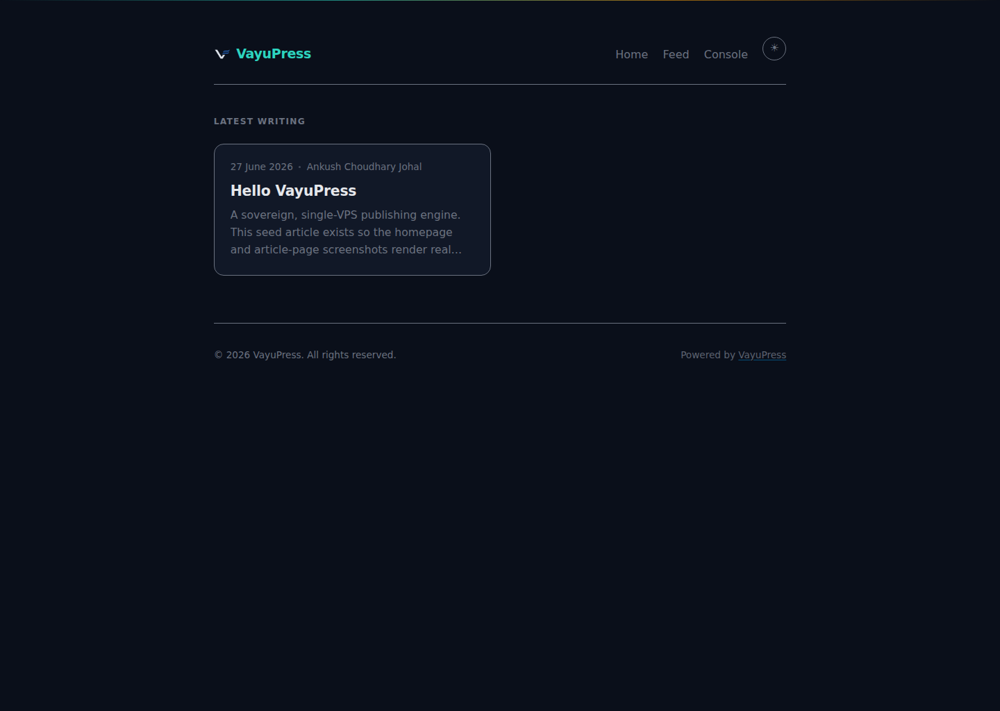

*Public homepage — article grid with tag filtering, dark/light mode toggle, zero-telemetry footer, system mode indicator. Styled on vendored Pico CSS served locally to keep the strict `style-src 'self'` CSP intact.*

### Article Page
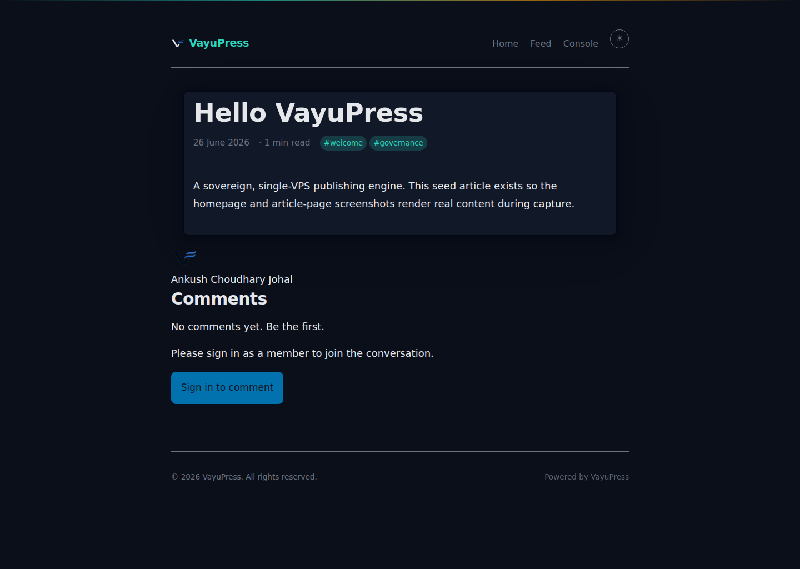

*Rendered article — JSON-LD schema, author/date meta, tag strip, reading time, zero third-party requests.*

---

### Theme Studio — Native to VayuOS

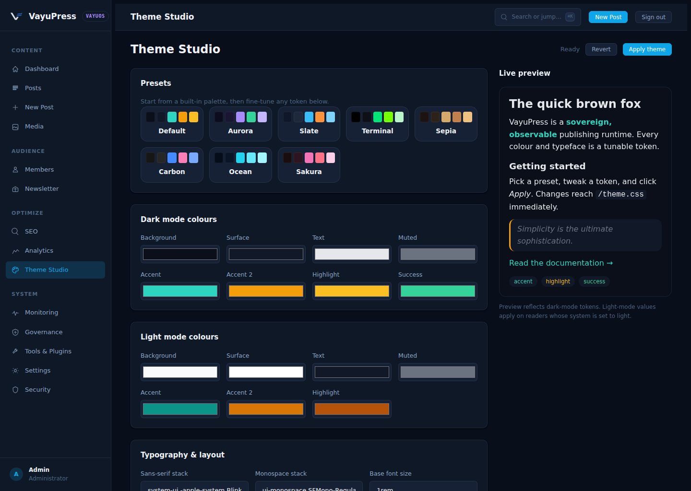

*The Theme Studio, now native to VayuOS (`/os/theme`) — a preset gallery
and design-token editor with an instant live preview. Colour ramps, typography
and spacing compile to a single sovereign stylesheet served from your own origin.
The preview applies values through CSSOM `setProperty`, so it stays inside the
strict `style-src 'self'` CSP — no inline styles, no third-party fonts, no CDNs
(ADR-0070, ADR-0069).*

---

### VayuOS — The Single Control Panel & Block Editor

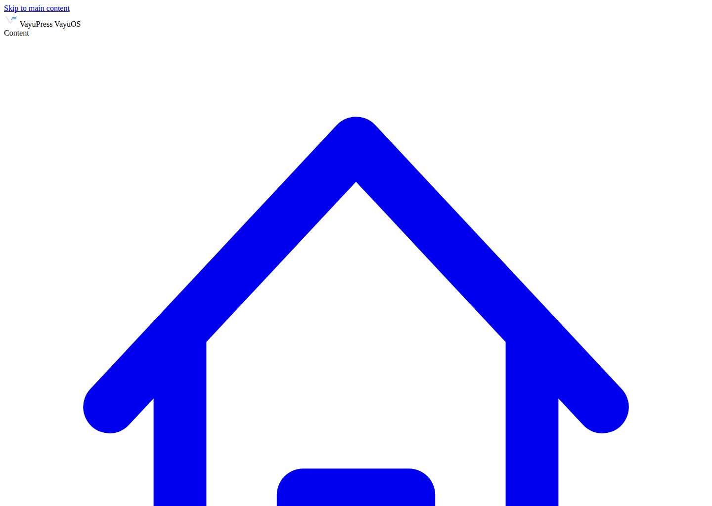

*The VayuOS dashboard (`/os`) — grouped sidebar, stat cards, 14-day
publishing-trend sparkline, activity feed, and command palette (⌘K).*

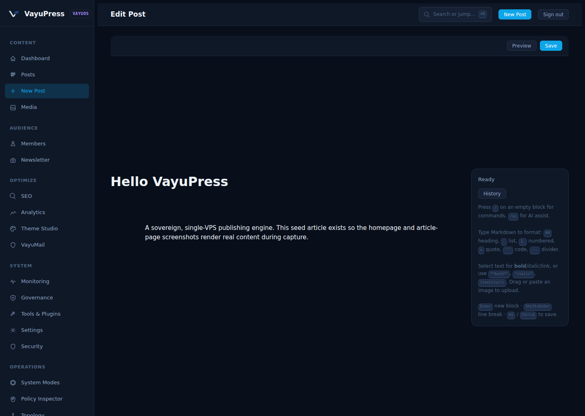

*The block editor — typed-block document rendered server-side through
escape + bluemonday UGC, slash-command palette with opt-in **AI-assist**, an
inline **version-history diff**, autosave, and live preview.*

As of v1.6.0 the flagship admin (`/os`) is the **only** admin surface —
it surpasses Ghost/WordPress/Substack in design and depth while staying a
sovereign single binary with **zero CDN dependencies** and a **strict CSP** (no
`unsafe-eval`, no `unsafe-inline`). Admin v2 has been removed; the legacy
`/admin`, `/admin/v2` and `/admin/v3` paths permanently (301) redirect here
(ADR-0068, ADR-0069 Stage 3).

- **Design system** — hand-authored, CSS-custom-property theming (dark/light/auto),
  grouped sidebar, command palette (⌘K), mobile bottom-nav. No inline styles.
- **Block editor** — typed-block document stored as JSON; every block is rendered
  to HTML server-side through escape + bluemonday UGC (`internal/blockrender`),
  with **no raw-HTML escape hatch**. Slash-command palette (with opt-in AI-assist),
  inline version-history diff, autosave, ⌘S, and a server-rendered +
  DOMPurify-guarded live preview. Legacy posts open losslessly and can be adopted
  into blocks via an explicit, reversible **Convert to blocks** action (ADR-0073),
  so a save can never wipe existing content.
- **Media library** — drag-and-drop upload (content-addressed, type-allowlisted,
  **SVG refused**, CSRF), grid browsing, copy-URL.
- **Two-factor auth (TOTP)** — RFC 6238 in pure stdlib (`internal/totp`, validated
  against the RFC test vectors), enforced on the VayuOS login surface.
- **Intelligence** — native SEO readiness dashboard and a privacy-preserving
  analytics page sourced only from the local database.

All interactivity is vanilla JS in same-origin files; the only inline `<script>`
is the per-request nonce-gated bootstrap, and DOM mutation uses
`createElement`/`textContent` — never `innerHTML` with untrusted data.

---

### Sign in & Sign up

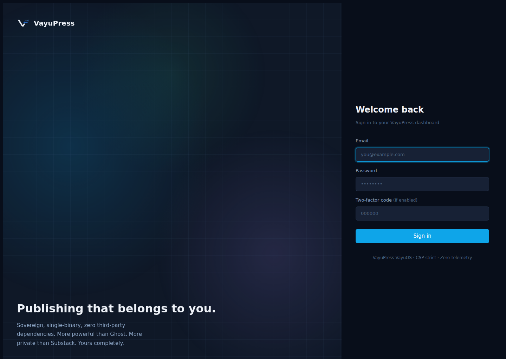

*The VayuOS sign-in page (`/os/login`) — passwordless-friendly, strict-CSP,
self-hosted. The single front door to the whole control panel.*


*The public reader/member signup page (`/signup`) — branded, site-themed,
passwordless. A reader enters their email and receives a one-time sign-in link
(the member is created on first use). Zero third-party requests.*

---

### Operator consoles — inside VayuOS

> As of v1.6.0 the operator consoles below are **no longer a separate admin
> panel** — they render inside the single VayuOS shell under `/os/*` (an
> **Operations** sidebar section). The legacy `/admin/modes`, `/admin/policy`,
> `/admin/topology`, `/admin/replay`, `/admin/faults` and `/admin/adr` page URLs
> permanently (301) redirect into VayuOS.

### System Modes & Policy Engine
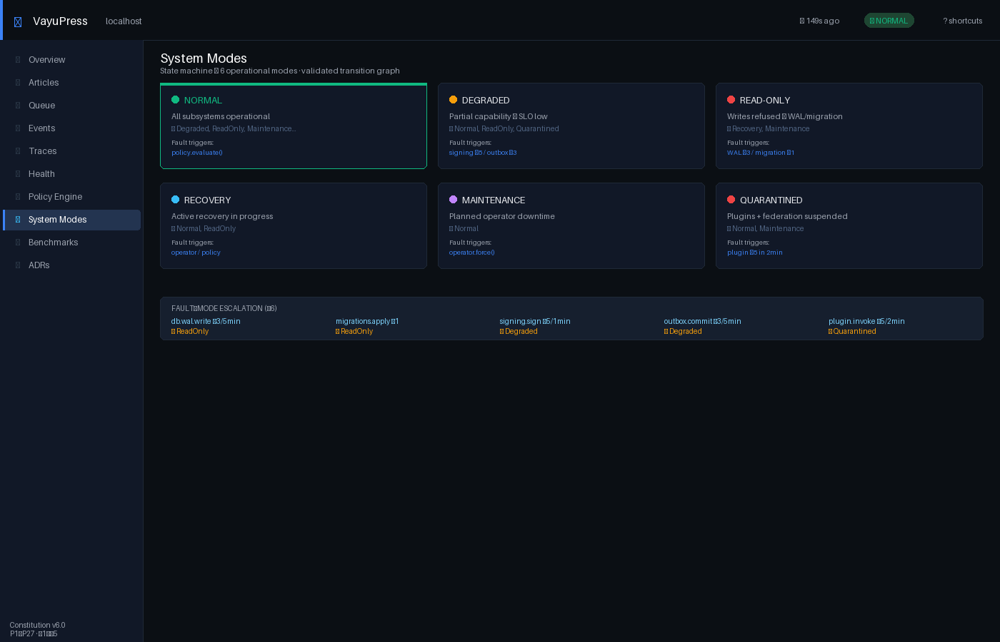

*Platform control plane (`/os/modes`) — 6 adaptive system modes with validated transition graph, append-only mode history, and all registered policies with live pass/warn/fail status.*

### Policy Provenance Inspector (Ω11)
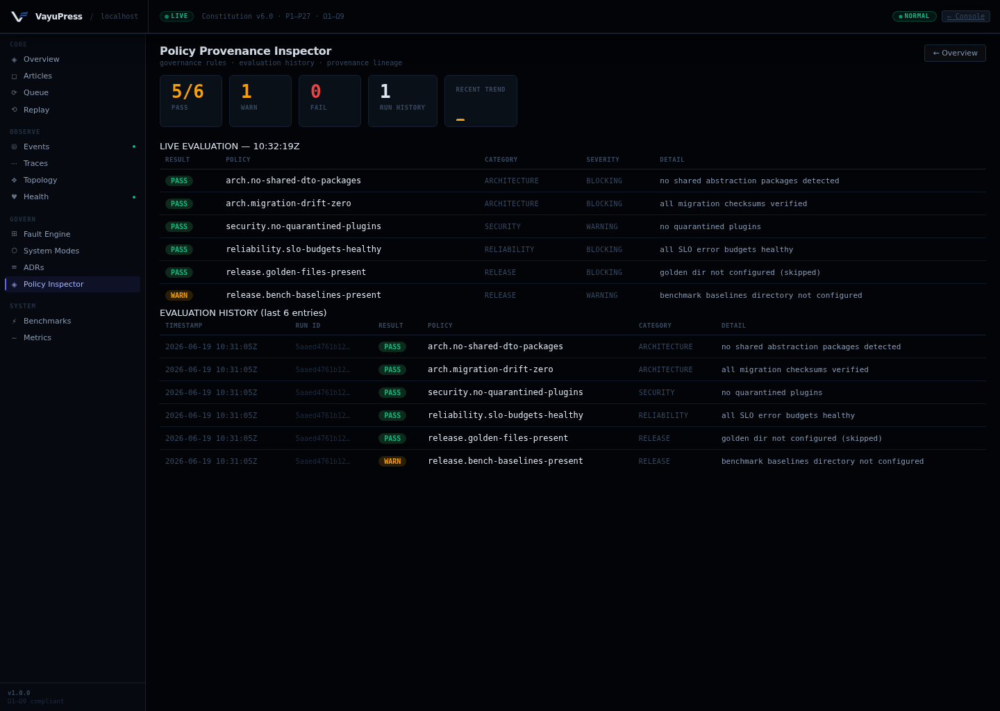

*Live policy evaluation table — per-policy category/severity/result strip, run-history trend, and persistent evaluation log for provenance and trend analysis.*

### Runtime Topology (Ω9)
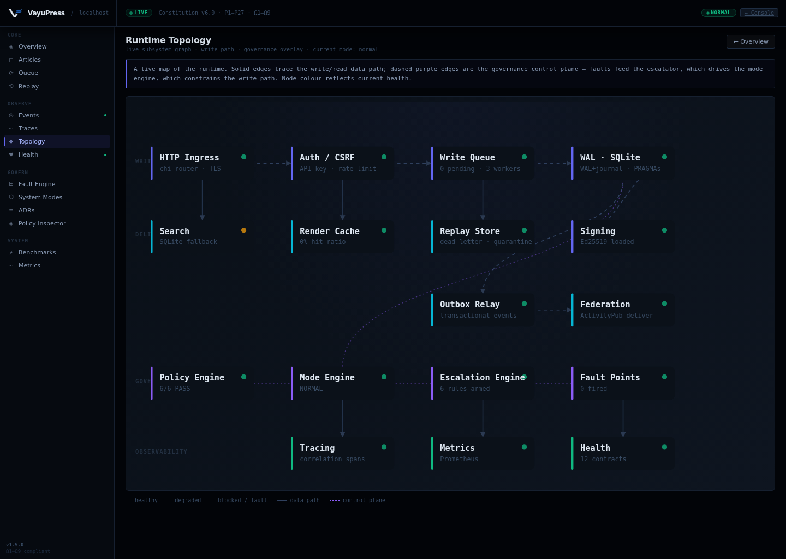

*Interactive operator console — 17-node live runtime graph (write path, delivery/read, governance, observability) with health derived in real time from failed-job counts, current mode, and fault-escalation state.*

### Replay Explorer (Ω10)
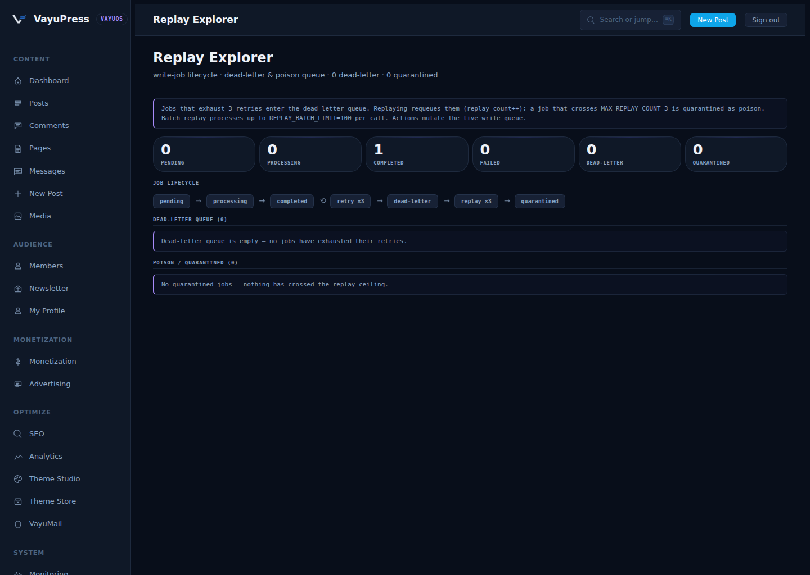

*Write-job lifecycle inspector — dead-letter & poison-queue surface with single-job and batch requeue, full lifecycle chain (pending → processing → completed → retry ×3 → dead-letter → replay ×3 → quarantined).*

### Fault Manager
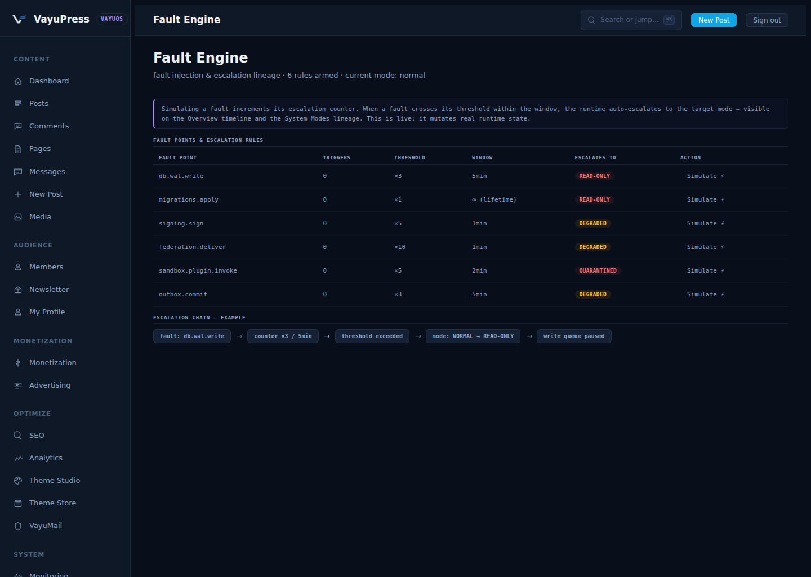

*Fault escalation surface — active faults with severity level, trigger source, and escalation path through the mode state machine.*

### ADR Registry
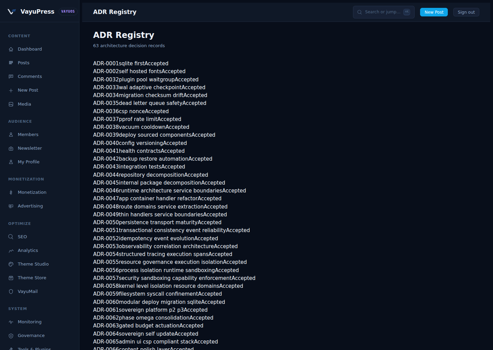

*Architecture Decision Records — every design decision indexed with status, date, and rationale. Governance documentation lives in the running system, not a separate wiki.*

---

## Quick Start

```bash
curl -sSL https://raw.githubusercontent.com/johalputt/vayupress/main/scripts/deploy-vayupress.sh | bash
```

Or clone and deploy manually:

```bash
git clone https://github.com/johalputt/vayupress.git
cd vayupress
sudo ./scripts/deploy-vayupress.sh
```

---

## What Is VayuPress?

VayuPress ("Vayu" — Sanskrit for wind/speed) is governed publishing infrastructure for developers, writers, and AI-assisted content engines who need:

- **Adaptive runtime governance** — policy-driven system modes (Normal/Degraded/ReadOnly/Recovery/Maintenance/Quarantined) with validated transition graph and operational convergence
- **Single-VPS efficiency** — runs on 12 GB RAM / 6 vCPU / 250 GB NVMe
- **Total control** over content, hosting, and data
- **No vendor lock-in** — SQLite, Go, Nginx, open standards only
- **Zero telemetry** — no tracking, no analytics harvesting, no third-party calls
- **Platform-kernel integrity** — immutable signing, migration integrity, identity model, event durability, and audit trail enforced by the policy engine
- **Security-first** — sandboxed subprocess plugins, capability enforcement, SSRF protection, durable replay protection, WORM audit log
- **Full observability** — structured JSON logging, distributed tracing, SLO error budgets, fault injection framework

---

## Architecture Overview

```
                     +----------------------------------+
                     |           Internet               |
                     +---------------+------------------+
                                     | HTTPS (443)
                     +---------------v------------------+
                     |    Nginx (TLS termination,        |
                     |    static files, gzip, CSP)       |
                     +---------------+------------------+
                                     | HTTP (127.0.0.1:8080)
             +---------------------------v------------------------------+
             |                VayuPress Go Binary                       |
             |                                                           |
             |  ┌─────────────────────────────────────────────────┐    |
             |  │            Platform Kernel (immutable)           │    |
             |  │  signing · migrations · did · outbox · policy   │    |
             |  │  slo · mode · audit                             │    |
             |  └─────────────────────────────────────────────────┘    |
             |                                                           |
             |  ┌──────────┐  ┌──────────┐  ┌────────────────────┐    |
             |  │  Router  │  │  Plugin  │  │   Write Queue      │    |
             |  │  (chi)   │  │  Pool    │  │   (async workers)  │    |
             |  └────┬─────┘  └────┬─────┘  └─────────┬──────────┘    |
             |       │              │                   │               |
             |  ┌────▼──────────────▼───────────────────▼──────────┐  |
             |  │              SQLite (WAL mode)                    │  |
             |  │  articles · media · write_jobs · audit_log        │  |
             |  │  outbox_events · delivered_events · replay_store  │  |
             |  └───────────────────────────────────────────────────┘  |
             |                                                           |
             |  Lifecycle Manager → Outbox Relay → Event Bus            |
             |  Policy Engine → System Modes → Subsystem Hooks          |
             |  Resource Watchdog → Sandbox Pool → Subprocess IPC       |
             +---------------------------+------------------------------+
                                         |
              +--------------------------+---------------------------+
              |                          |                           |
   +----------v----------+  +-----------v---------+  +-------------v------+
   |  Meilisearch        |  |  Isso               |  |  fail2ban / UFW    |
   |  (optional search)  |  |  (self-hosted       |  |  (firewall)        |
   |  <50ms p95          |  |   comments)         |  |                    |
   +---------------------+  +---------------------+  +--------------------+
```

---

## Platform Kernel

VayuPress has an **immutable platform kernel** — components that define invariants no plugin, extension, or subsystem can bypass. Changes require an RFC and 2/3 supermajority vote.

| Component | Package | Invariant |
|-----------|---------|-----------|
| **Signing** | `internal/signing` | Every published article has a valid Ed25519 signature |
| **Capability Enforcement** | `internal/sandbox` | Plugin capabilities checked against manifest before every Invoke() |
| **Migration Integrity** | `internal/migrations` | Checksums verified against embedded SQL; drift is a hard error |
| **Identity Model** | `internal/did` | DID:key authentication; no shared-secret fallback |
| **Event Durability** | `internal/outbox` | Events written to outbox in same transaction as state change |
| **Audit Trail** | `internal/migrations` (journal) | Migration journal is append-only; no entry may be deleted |
| **SLO Error Budget** | `internal/slo` | BudgetExhausted() blocks the release gate |
| **Policy Engine** | `internal/policy` | All governance policies registered here; no ad hoc enforcement |

See [docs/architecture/kernel-boundary.md](docs/architecture/kernel-boundary.md) for the full kernel boundary specification.

---

## System Modes

VayuPress operates in one of six adaptive system modes, governed by the policy engine:

| Mode | Trigger | Effect |
|------|---------|--------|
| `normal` | Default | All subsystems fully operational |
| `degraded` | SLO error budget exhausted | Feature work pauses; writes allowed |
| `read-only` | Migration checksum drift | Writes refused; recovery required |
| `recovery` | Active recovery operation | Migration apply allowed; writes blocked |
| `maintenance` | Operator-initiated | Planned downtime; controlled shutdown |
| `quarantined` | Plugin quarantine threshold | Plugin and federation suspended |

Transitions are validated against a deterministic graph. Every transition is logged to an append-only history. Policy evaluation drives automatic transitions; operators can force transitions via CLI.

See [docs/architecture/system-modes.md](docs/architecture/system-modes.md).

---

## Internal Package Architecture

| Package | Role |
|---------|------|
| `cmd/vayupress` | Bootstrap, route wiring, graceful shutdown |
| `internal/ai` | Local embedding, semantic search, policy-governed inference |
| `internal/api` | ArticleService, repository pattern, typed domain errors |
| `internal/archcheck` | AST-level architecture validator (import rules, global state, shared abstractions) |
| `internal/auth` | JWT, CSRF, Argon2id hashing, rate-limit buckets |
| `internal/cluster` | Leader election, node coordination |
| `internal/compat` | Compatibility golden tests for Stable contract verification |
| `internal/config` | Env-driven config, version compatibility validation |
| `internal/db` | SQLite init, WAL checkpoint, migrations via `embed.FS` |
| `internal/did` | DID:key authentication with Ed25519 |
| `internal/events` | Typed event structs, Envelope, Bus, idempotent dispatch |
| `internal/fault` | Fault injection framework — named probabilistic fault points |
| `internal/federation` | ActivityPub inbox/outbox, replay protection, adversarial hardening |
| `internal/governance` | RFC voting, supermajority enforcement |
| `internal/graph` | Merkle tree content integrity |
| `internal/health` | Structured health contracts (`/health/*` endpoints) |
| `internal/httputil` | WriteJSON, WriteError, DecodeJSON — thin HTTP primitives |
| `internal/lifecycle` | Ordered startup/shutdown with named phases |
| `internal/logging` | Structured JSON logging with correlation/causation fields |
| `internal/merkle` | SHA-256 Merkle tree for article content proofs |
| `internal/metrics` | Atomic metric counters, snapshot collection |
| `internal/migrations` | Migration engine with dry-run, checksum verification, journal, rollback |
| `internal/mode` | System Mode state machine — policy-driven adaptive runtime |
| `internal/outbox` | Transactional outbox relay — poll + dispatch event envelopes |
| `internal/plugins` | Hook registry, worker pool, subprocess plugin management |
| `internal/policy` | Platform Policy Engine — architecture/security/reliability/release governance |
| `internal/profiling` | Rate-limited pprof, health fingerprints, goroutine leak detection |
| `internal/queue` | SQLite-backed async write queue, dead-letter replay |
| `internal/registry` | Plugin manifest registry |
| `internal/render` | Article renderer, cache writer, CSS asset generator |
| `internal/resource` | Semaphore-based concurrency limiters, resource watchdog |
| `internal/sandbox` | Subprocess IPC pool, Linux seccomp/namespaces, capability enforcement |
| `internal/search` | FTS5 + semantic search, Meilisearch client, sharded index |
| `internal/signing` | Ed25519 article signing and verification |
| `internal/slo` | SLO error budget tracking — rolling windows, exhaustion signals |
| `internal/storage` | Content-addressed storage, IPFS stubs |
| `internal/testutil` | Shared test helpers |
| `internal/trace` | Span-based tracing with correlation/causation IDs |
| `internal/ws` | WebSocket/SSE hub for real-time event streaming |

---

## Feature List (P1–P27 + Ω1–Ω11)

### Core Publishing (P1–P8)
- RESTful JSON API for articles (CRUD with slugs, tags, full-text content)
- Async write queue — SQLite-backed, crash-safe, with dead-letter replay
- **Scheduled publishing** — stage future-dated posts (RFC3339), promoted through
  the normal render/index/cache pipeline by a durable SQLite-backed ticker that
  also catches up anything missed during downtime
- **Sovereign email & newsletter** — plain-SMTP delivery on the Go standard
  library (no third-party SDKs, no hosted senders), double opt-in confirmations,
  and one-click broadcasts with auto unsubscribe links; a safe no-op until
  `SMTP_HOST` is set. A full **Newsletter console** (`/os/newsletter`) adds
  audience-health stats, a growth sparkline, a searchable subscriber table with
  CSV export and delete, a broadcast composer with send-test, and a persisted
  broadcast delivery history
- **Automatic image optimization** — stdlib-only (no libvips/CGO) downscaling of
  oversized PNG/JPEG editor uploads with area-averaging resampling; GIF/WebP pass
  through untouched
- **Sovereign rich media (ADR-0070)** — `embed` blocks unfurl any URL into a
  self-hosted link card; YouTube/Vimeo render as privacy-first click-to-load
  facades (no third-party request until the reader clicks). A pure-Go Mermaid→SVG
  engine compiles **six** diagram grammars (flowchart, sequence, pie, state,
  class, gantt) server-side with zero client JavaScript. Every server-side fetch
  goes through the SSRF-hardened `safefetch` client; all output is bluemonday-
  sanitised with no raw-HTML escape hatch
- Sitemap XML, RSS feed, and robots.txt auto-generation
- In-memory render cache with static-file output via Nginx
- SQLite WAL mode with adaptive checkpointing
- Migration checksum drift detection — halts startup on tampering
- Immutable WORM audit log via SQLite `ABORT` triggers
- Plugin hook system with worker pool, panic recovery, and circuit-breaker disable

### Security & Governance (P9–P13)
- **Multi-author accounts & password login** — Argon2id-hashed credentials,
  server-side SQLite sessions (only token SHA-256 stored), hardened
  `HttpOnly`/`SameSite=Lax` cookie; admin pages accept an API key **or** a login
  session. Bootstrap via `vayupress user add … --admin`
- Automated CI governance — 15+ CI jobs, `ci-pass` gate
- Supply-chain secret scanning (TruffleHog), license compliance, shell linting
- Structured health contracts: `/health/live`, `/health/ready`, `/health/dependencies`, `/health/storage`, `/health/search`, `/health/queue`
- `/health/ethics` — machine-readable ethics compliance endpoint
- Ethical AI Charter in `ETHICS.md` (no training on user data, no telemetry)

### Multi-Package Architecture (P14–P19)
- 35+ `internal/` packages with compiler-enforced boundaries
- `App` struct owns all mutable runtime state — no package-level globals
- Repository pattern: `ArticleRepo` interface backed by SQLite
- Integration test harness with `go test -race ./...`

### Integrations & Insight (Tier 2)
- **Privacy-first analytics** — cookieless, consent-free page-view counting with
  zero PII (no IPs, UAs, cookies, or per-visitor rows); only daily aggregates per
  path/referrer. `GET /api/v1/admin/analytics`
- **Outbound webhooks** — HMAC-SHA256-signed JSON POSTs on
  article create/update/delete to Zapier/n8n/Make/custom services, with bounded
  retry and a per-hook delivery audit trail
- **Social auto-posting** — newly published articles auto-share to
  Mastodon/Pleroma/Akkoma via a single app token (no OAuth dance), async and
  best-effort with idempotency
- **Built-in Ghost & WordPress importers** — `vayupress migrate ghost --file …`
  and `vayupress migrate wordpress --file …` move content off both platforms with
  no external tooling (titles, slugs, dates, tags, draft status preserved)
- **Sovereign AI writing assistant** — summarize / improve / titles / SEO /
  continue, powered by a **local** Ollama server (no hosted model, no telemetry).
  Suggest-only — never auto-edits. `POST /api/v1/admin/ai/assist`
- **Memberships & paywalls** — passwordless magic-link reader login, **priced
  multi-tier subscription plans** (with optional free trials) and a public
  pricing page (`/pricing`), a self-service member portal (`/members/account`),
  per-article access levels (public/members/paid) with a tier-aware preview +
  CTA, member labels for segmentation, a **subscription dashboard** with MRR,
  ARR, conversion, churn, ARPU, LTV, a growth sparkline, revenue-by-tier and a
  member activity feed, **CSV export** + member search, graceful cancellations,
  and an optional signature-verified Stripe webhook for paid upgrades (no
  embedded payment SDK)

### Event-Driven Reliability (P20–P22)
- Transactional outbox — events written atomically with article mutations
- `lifecycle.Manager` — ordered startup/shutdown with registered components
- Typed event structs with versioned schemas (`article.created.v1`)
- Idempotent dispatch via `delivered_events` deduplication table

### Observability & Tracing (P22–P23)
- Structured JSON logging with `LogFields` — correlation/causation IDs on every line
- Span-based tracing: `Start`, `SetAttribute`, `End`
- SLO error budgets with rolling windows — 5 production SLOs tracked

### Resource Governance & Sandboxing (P24–P26)
- Named semaphore limiters (`articles.write`, `plugin.exec`)
- Subprocess IPC pool for out-of-process plugin execution
- Linux seccomp filtering and namespace isolation for subprocess plugins
- Capability enforcement — subprocess plugins run with dropped privileges

### Platform Stewardship (Ω1–Ω5)
- **Security audit corpus** — 6 security documents (attack surfaces, trust model, incident response, federation threats, sandbox boundaries, signing model)
- **Compatibility contracts** — stability matrix for 30+ packages, golden tests for Stable API contracts
- **Architecture governance** — bounded-context rules, ADR index (23 ADRs), import-layer validator
- **Migration resilience** — dry-run, checksum verification, append-only journal, rollback simulation
- **Federation adversarial hardening** — malformed payload rejection, SQLite-durable replay protection
- **Platform Policy Engine** — 6 canonical policies (architecture, security, reliability, release) unified under `internal/policy`
- **WAL concurrency** — stress tests verifying write serialisation and busy-timeout behaviour
- **Kernel boundary document** — immutable vs replaceable component classification
- **System Modes** — 6-mode adaptive state machine with validated transition graph, policy-driven automatic transitions, and subsystem hook registry
- **Fault injection framework** — named probabilistic fault points with deterministic replay for adversarial testing

### Operational Cognition & Operator Console (Ω6–Ω11)
- **Ω6 — Durable mode journal** — every system-mode transition persisted to SQLite with cause attribution; survives restart
- **Ω7 — Kernel/trace/event/fault panels** — live runtime introspection surfaces on the admin dashboard
- **Ω8 — Unified Operational Timeline** — single causal narrative correlating mode transitions, faults, escalations, and queue events with relative + wall-clock time
- **Ω9 — Interactive operator console** — real control-plane pages that mutate live runtime state:
  - **System Mode Engine** (`/admin/modes`) — drive transitions through the validated graph; invalid moves rejected 409
  - **Fault Engine** (`/admin/faults`) — operator-driven fault simulation feeding the escalation threshold
  - **Runtime Topology** (`/admin/topology`) — 17-node live health graph
- **Ω10 — Live-streaming timeline + Replay Explorer** — animated causal arrows, STREAMING poller, and a dead-letter / poison-queue inspector (`/admin/replay`) with single-job and batch requeue
- **Ω11 — Policy Provenance Inspector** (`/admin/policy`) — SQLite-journaled policy evaluations (`policy_evaluations` table), live pass/warn/fail status, run-history trend sparkline, and a persistent provenance log of every policy run

### Theme & Site Settings Control Panel (`/admin/theme`)

A governed customisation surface — every input is validated, no raw markup is
trusted, and the strict CSP stays intact:

- **Identity** — site name, tagline, meta description, author. Baked into every
  public page; a save triggers a full rendered-cache purge so changes propagate.
- **Palette** — light/dark primary + accent colours (hex-validated). Rendered as
  Pico CSS-variable overrides and served same-origin at **`/theme.css`** (ETag +
  short max-age) — never inlined, so `style-src 'self'` holds. The first-deploy
  defaults match the vendored `custom.css`, so there is no flash-of-unstyled-content.
- **Studio** — a sovereign design-token theme system (ADR-0070, `internal/theme`):
  a typed 23-field token schema, a hex-validated CSS-variable compiler, and **eight
  system-font presets** (Default, Aurora, Slate, Terminal, Sepia, Carbon, Ocean,
  Sakura). The Studio tab shows a preset gallery and a **live preview** that
  re-themes instantly via CSSOM `setProperty` — no inline `<style>`, no `style=`
  attributes, so the strict CSP is untouched. Apply persists to `theme_tokens`
  (migration 029), recompiles `/theme.css`, and purges the render cache. API:
  `GET/POST /api/v1/admin/theme/{presets,tokens,preview,apply}` (auth + CSRF).
- **Custom CSS** — operator stylesheet, 16 KB cap, folded into `/theme.css`.
  Cannot reach external origins or execute scripts (CSP-contained).
- **Head & SEO** — *declarative, allowlisted* capabilities (keywords, theme-color,
  robots, Google/Bing verification) rendered to escaped `<meta>` tags. Raw `<head>`
  HTML is intentionally **not** accepted — meta-refresh redirects, external
  beacons, and `<base>` hijacks are structurally impossible, not merely filtered.
- **Storage & safety** — persisted in the `site_settings` table (migration 006,
  content-checksummed like every migration); writes are CSRF-protected, blocked in
  `read-only`/`quarantined` modes, and audit-logged (`component: "theme"`).
- **Public theme toggle** — a sun/moon switch in the site header persists the
  reader's choice in `localStorage`; served as a same-origin script so it needs no
  CSP nonce (which cached HTML cannot carry).
- **CSP telemetry** — violations report to `POST /csp-report`, incrementing
  `vayupress_csp_violations_total` and logging the offending directive, so runtime
  CSP drift is observable rather than silent.

---

## API Endpoints Overview

| Method | Path | Description |
|--------|------|-------------|
| `GET` | `/api/articles` | List articles (paginated, filterable by tag) |
| `POST` | `/api/articles` | Create article (async write queue) |
| `GET` | `/api/articles/{slug}` | Get article by slug |
| `PUT` | `/api/articles/{slug}` | Update article |
| `DELETE` | `/api/articles/{slug}` | Delete article |
| `GET` | `/api/search?q=...` | Full-text search (Meilisearch or SQLite fallback) |
| `GET`/`POST` | `/api/v1/graphql` | Read-only GraphQL content API (query-only — no mutations) (ADR-0067) |
| `GET` | `/api/v1/i18n/{lang}` | Merged i18n message bundle for a language (public) |
| `GET` | `/api/v1/stream` | Real-time SSE feed of article events (API-key-gated) |
| `GET`/`PUT` | `/api/v1/admin/i18n[/{lang}]` | List/override i18n languages (PUT CSRF-protected) |
| `GET`/`PUT` | `/api/v1/admin/email-templates[/{kind}]` | List/override transactional email templates (PUT CSRF-protected) |
| `GET` | `/manifest.json` · `/sw.js` | PWA manifest + offline service worker |
| `GET` | `/static/chroma.css` | Syntax-highlighting stylesheet (`style-src 'self'`) |
| `GET` | `/health/live` | Liveness probe |
| `GET` | `/health/ready` | Readiness probe |
| `GET` | `/health/dependencies` | Dependency health (DB, search, queue) |
| `GET` | `/health/storage` | Storage quota and utilization |
| `GET` | `/health/search` | Meilisearch status and circuit-breaker state |
| `GET` | `/health/queue` | Write queue depth and worker stats |
| `GET` | `/health/ethics` | Machine-readable ethics compliance |
| `GET` | `/sitemap.xml` | Auto-generated XML sitemap |
| `GET` | `/feed.xml` | Auto-generated RSS feed |
| `GET` | `/robots.txt` | Auto-generated robots.txt |
| `GET` | `/api/v1/openapi.json` | OpenAPI 3.0 description of the API (embedded, public) |
| `GET` | `/metrics` | Internal metrics snapshot (admin auth required) |

### Operator console (admin auth required)

| Method | Path | Description |
|--------|------|-------------|
| `GET` | `/admin` | Runtime governance dashboard + Unified Operational Timeline |
| `GET` | `/admin/modes` | System Mode Engine — drive validated mode transitions |
| `GET` | `/admin/faults` | Fault Engine — operator-driven fault simulation |
| `GET` | `/admin/topology` | Runtime Topology — 17-node live health graph |
| `GET` | `/admin/replay` | Replay Explorer — dead-letter & poison queue |
| `GET` | `/admin/policy` | Policy Provenance Inspector — journaled evaluations |
| `GET` | `/admin/theme` | Theme & Site Settings control panel |
| `POST` | `/admin/theme` | Save theme/identity settings (CSRF-protected) |
| `POST` | `/admin/mode/transition` | Transition system mode (CSRF-protected) |
| `POST` | `/admin/fault/simulate` | Fire a named fault (CSRF-protected) |
| `POST` | `/admin/replay/job` | Requeue a single dead-letter job (CSRF-protected) |
| `POST` | `/admin/benchmark` | Run the in-process load benchmark (CSRF-protected) |
| `GET` | `/api/v1/admin/severity` | Formal operational severity taxonomy (self-documenting) |
| `GET` | `/api/v1/admin/budgets` | Governance error-budget state + recommended escalation |
| `GET` | `/api/v1/admin/search/drift` | Search-index vs article-store drift report |
| `POST` | `/admin/search/reindex` | Rebuild the search index from the store (CSRF-protected) |
| `POST` | `/api/v1/admin/newsletter/broadcast` | Email all confirmed subscribers (CSRF-protected) |
| `GET` | `/os/api/newsletter/stats` | Newsletter audience stats + 30-day growth (session) |
| `GET` | `/os/api/newsletter/export.csv` | Export all subscribers as CSV (session) |
| `DELETE` | `/os/api/newsletter/subscribers/{id}` | Delete a subscriber (CSRF-protected) |
| `POST` | `/os/api/newsletter/test` | Send a test broadcast to one address (CSRF-protected) |
| `POST` | `/os/api/newsletter/broadcast` | Send a tracked broadcast to all confirmed subscribers (CSRF-protected) |
| `GET` | `/api/v1/admin/schedule` | List staged scheduled posts |
| `POST` | `/api/v1/admin/schedule` | Stage a future-dated post (CSRF-protected) |
| `DELETE` | `/api/v1/admin/schedule/{id}` | Cancel a scheduled post (CSRF-protected) |
| `GET` | `/api/v1/admin/users` | List author accounts (admin role) |
| `POST` | `/api/v1/admin/users` | Create an account (admin role, CSRF-protected) |
| `DELETE` | `/api/v1/admin/users/{email}` | Delete an account (admin role, CSRF-protected) |
| `POST` | `/os/login` | Email + password sign-in (issues session cookie) |
| `POST` | `/os/logout` | Destroy the current session |
| `GET` | `/api/v1/admin/analytics` | Privacy-first page-view summary (cookieless) |
| `GET` | `/api/v1/admin/webhooks` | List outbound webhooks |
| `POST` | `/api/v1/admin/webhooks` | Register a webhook (CSRF-protected) |
| `DELETE` | `/api/v1/admin/webhooks/{id}` | Delete a webhook (CSRF-protected) |
| `GET` | `/api/v1/admin/webhooks/{id}/deliveries` | Webhook delivery audit trail |
| `GET` | `/api/v1/admin/ai/status` | AI assistant availability + supported ops |
| `POST` | `/api/v1/admin/ai/assist` | Run a local-LLM writing operation (CSRF-protected) |
| `POST` | `/api/v1/members/login` | Request a passwordless member sign-in link |
| `GET` | `/members` · `/members/account` | Member sign-in page · self-service portal |
| `GET` | `/members/verify` | Consume a magic link, start a member session |
| `GET` | `/pricing` · `/api/v1/tiers` | Public pricing page · tier catalogue (JSON) |
| `GET` | `/api/v1/admin/members` | List members + tier counts |
| `GET` | `/api/v1/admin/members/stats` | Membership stats — MRR, ARR, conversion, churn, ARPU, LTV, growth, revenue-by-tier, activity |
| `GET` | `/api/v1/admin/members/export.csv` | Export all members as CSV (backups / migration) |
| `GET` | `/api/v1/admin/members/{email}` | Member detail + active subscription + activity timeline |
| `PUT` | `/api/v1/admin/members/{email}/tier` | Set a member's tier (CSRF-protected) |
| `PUT` | `/api/v1/admin/members/{email}/cancel` | Cancel a subscription — at period end, or `{immediate:true}` (CSRF-protected) |
| `POST`/`DELETE` | `/api/v1/admin/members/{email}/labels[/{label}]` | Add/remove a member label (CSRF-protected) |
| `GET`/`POST`/`PUT`/`DELETE` | `/api/v1/admin/tiers[/{id}]` | Manage subscription tiers (writes CSRF-protected) |
| `GET`/`POST`/`DELETE` | `/api/v1/admin/users[/{email}]` | List / create / remove team accounts (writes CSRF-protected) |
| `PUT` | `/api/v1/admin/users/{email}/role` | Change a team member's role (CSRF-protected) |
| `GET` | `/author/{id}` | Public author profile (avatar, bio, social links) |
| `PUT` | `/api/v1/admin/articles/{slug}/access` | Set article access level (CSRF-protected) |
| `POST` | `/api/v1/stripe/webhook` | Signed Stripe webhook → paid upgrades (optional) |

Public theming endpoints (no auth): `GET /theme.css` (operator palette + custom
CSS, served same-origin for CSP), `GET /static/js/theme-toggle.js` (sun/moon
switcher), `POST /csp-report` (CSP violation telemetry → `vayupress_csp_violations_total`).

Full reference: [docs/API-REFERENCE.md](docs/API-REFERENCE.md)

---

## Companion Tools

> **New in v1.1.0 — built-in `migrate` command.** The main binary now imports
> Markdown folders directly, no separate tool to build:
> ```bash
> vayupress migrate markdown --dir ./posts --dry-run   # preview
> vayupress migrate markdown --dir ./posts             # import
> vayupress migrate info                               # all platform options
> ```
> Imports write both the sanitised article and an `article_sources` side-car so
> the VayuOS block editor can reopen each post losslessly. See
> [`docs/MIGRATION.md`](docs/MIGRATION.md) for the full guide.

Standalone migration and import tools live under [`tools/`](tools/). Each is an
independent Go module — builds without pulling in the engine.

### Migration Tools

| Tool | Migrates from | Source |
|------|--------------|--------|
| **ghost-to-vayu** | Ghost CMS (MySQL or SQLite direct DB) | [`tools/ghost-to-vayu`](tools/ghost-to-vayu) |
| **wordpress2vayu** | WordPress MySQL — posts, pages, categories, tags, featured images | [`tools/wordpress2vayu`](tools/wordpress2vayu) |
| **hugo2vayu** | Hugo Markdown sites (YAML + TOML frontmatter) | [`tools/hugo2vayu`](tools/hugo2vayu) |
| **jekyll2vayu** | Jekyll `_posts` (YAML frontmatter, date-in-filename) | [`tools/jekyll2vayu`](tools/jekyll2vayu) |
| **substack2vayu** | Substack `posts.csv` export | [`tools/substack2vayu`](tools/substack2vayu) |
| **notion2vayu** | Notion HTML export (ZIP or directory) | [`tools/notion2vayu`](tools/notion2vayu) |
| **medium2vayu** | Medium HTML export (ZIP or directory) | [`tools/medium2vayu`](tools/medium2vayu) |
| **markdownfolder2vayu** | Any folder of Markdown files with YAML frontmatter | [`tools/markdownfolder2vayu`](tools/markdownfolder2vayu) |

All migration tools share the same design: direct source access (no API keys needed), keyset pagination, throttled batching, checkpoint/resume, and idempotent `INSERT OR IGNORE` writes.

### Operational Tools

| Tool | Purpose | Source |
|------|---------|--------|
| **vayu-backup** | Compress, verify, and restore VayuPress SQLite databases | [`tools/vayu-backup`](tools/vayu-backup) |
| **vayu-export** | Render all articles to a static HTML site for CDN or archiving | [`tools/vayu-export`](tools/vayu-export) |
| **vayu-validate** | Content integrity checker — slug validity, duplicates, bad dates, oversized content | [`tools/vayu-validate`](tools/vayu-validate) |

```bash
# Migrate from Ghost
cd tools/ghost-to-vayu && go build -o ghost2vayu ./cmd/ghost2vayu
./ghost2vayu migrate --ghost-driver mysql \
  --ghost-dsn "user:pass@tcp(localhost:3306)/ghost_production" \
  --vayu-db /var/lib/vayupress/vayupress.db

# Import Markdown posts
cd tools/markdownfolder2vayu && go build -o md2vayu ./cmd/md2vayu
./md2vayu import --dir ./posts --vayu-db /var/lib/vayupress/vayupress.db

# Validate after migration (exits 1 on errors — CI-safe)
cd tools/vayu-validate && go build -o vayu-validate ./cmd/vayu-validate
./vayu-validate validate --db /var/lib/vayupress/vayupress.db
```

### Built-in Plugin Features

These features are part of VayuPress core (no external service required):

| Feature | Package | API |
|---------|---------|-----|
| **SEO Optimizer** | `internal/seo` | Auto OpenGraph, Twitter Card, JSON-LD per article |
| **Comments** | `internal/comments` | `POST /api/v1/articles/{slug}/comments` + moderation |
| **Article Versions** | `internal/versions` | `GET /api/v1/admin/articles/{slug}/versions` |
| **Series/Collections** | `internal/collections` | `GET/POST /api/v1/collections` |
| **Newsletter** | `internal/newsletter` | `POST /api/v1/newsletter/subscribe` |
| **Webmentions** | `internal/webmention` | `POST /webmention` (W3C receiver) |
| **Draft Preview Links** | `internal/preview` | `POST /api/v1/admin/preview` |
| **Redirect Manager** | `internal/redirects` | `GET/POST /api/v1/admin/redirects` |
| **Table of Contents** | `internal/toc` | `GET /api/v1/articles/{slug}/toc` |
| **ActivityPub / Federation** | `internal/federation` | Outbox relay + HTTP Signatures |
| **Spam Guard** | `internal/spam` | Comment classification middleware |
| **Content Signing** | `internal/signing` | HMAC article verification |
| **Sovereign Self-Update** | `internal/update` | One-click signed update + full backup/restore in VayuOS, plus signature-verified CLI apply |

### Admin UI — VayuOS (`/os`)

VayuOS is the single, editor-first admin on a fully vendored, CSP-compliant
stack (no CDNs, no `unsafe-eval`, per-request nonces). The typed block editor
has AI-assist, inline version-history diff, live preview, a command palette
(⌘K), distraction-free mode, word count / reading time, an SEO readiness meter
and autosave. The historical Admin v2 (`/admin/v2`, ADR-0065) was removed in
v1.6.0 (ADR-0069 Stage 3); its routes now permanently redirect to `/os`. See
[docs/ADMIN-UI.md](docs/ADMIN-UI.md),
[ADR-0068](docs/adr/ADR-0068-admin-v3-next-gen-ui.md) and
[ADR-0069](docs/adr/ADR-0069-admin-v2-retirement-plan.md).

### Self-Update & Backup

VayuPress updates itself and backs up your whole site **sovereignly and safely**,
either from VayuOS (**System → Update & Backup**, `/os/update`) or the CLI:

```bash
vayupress update check               # read-only version/changelog check
vayupress update apply --dry-run     # verify checksum + Ed25519 signature, change nothing
vayupress update apply               # gated, signed, backed-up binary swap
```

From the **Update & Backup** panel an admin can, in one click: check for and
install the latest signed release (verify → auto-backup → atomic swap →
self-restart), roll back to the previous binary, **download a full backup** of
the database and every setting as a single consistent `.tar.gz`, and **restore**
from such a file (validated, with an automatic pre-restore backup, applied
atomically at the next start). Export and import have **no size limit** — they
stream with the request timeouts lifted.

Applying an update requires opt-in (`VAYU_SELFUPDATE_ENABLED=true`) and an
operator-pinned Ed25519 key (`VAYU_RELEASE_PUBKEY`), is refused in
read-only/quarantine/maintenance mode, backs up the database first, and verifies
the signature before writing anything — whether triggered from the UI or the
CLI. See [docs/UPGRADING.md](docs/UPGRADING.md),
[docs/SECURITY.md](docs/SECURITY.md),
[ADR-0064](docs/adr/ADR-0064-sovereign-self-update.md), and
[ADR-0089](docs/adr/ADR-0089-vayuos-one-click-update-and-backup.md).

---

## Requirements

| Requirement | Detail |
|-------------|--------|
| Go | 1.23+ (build from source; deploy script installs 1.25) |
| CGO / SQLite3 | `gcc` required (`libsqlite3-dev` or bundled via `go-sqlite3`) |
| OS | Ubuntu 24.04 LTS (recommended); Linux kernel 5.x+ for sandbox features |
| RAM | 8 GB minimum, 12 GB recommended |
| CPU | 4 vCPU minimum, 6 vCPU recommended |
| Disk | 50 GB NVMe minimum, 250 GB for 1M+ posts with media |
| Access | Root or sudo for deploy script |

---

## Deployment

### Automated (recommended)

```bash
# Download and run the deploy script
curl -sSL https://raw.githubusercontent.com/johalputt/vayupress/main/scripts/deploy-vayupress.sh | bash

# Dry-run first (inspect what will be installed)
bash scripts/deploy-vayupress.sh --dry-run

# Upgrade an existing installation
bash scripts/deploy-vayupress.sh --upgrade
```

The deploy script handles: Go toolchain, CGO/SQLite3, binary build, Nginx with TLS and CSP, systemd service, Meilisearch (optional), nightly backup cron, fail2ban rules.

### Manual Build

```bash
git clone https://github.com/johalputt/vayupress.git
cd vayupress
go build -race ./...                                   # development build
go build -ldflags="-s -w" -trimpath ./cmd/vayupress   # production binary
```

---

## Development Setup

```bash
git clone https://github.com/johalputt/vayupress.git
cd vayupress

go build ./...          # build all packages
go test -race ./...     # full test suite with race detector
go vet ./...            # static analysis
gofmt -l .              # format check

make build test lint    # all-in-one
```

### Environment Variables

| Variable | Default | Description |
|----------|---------|-------------|
| `VAYU_DOMAIN` | `localhost` | Public domain name |
| `VAYU_PORT` | `8080` | HTTP listen port |
| `VAYU_DB_PATH` | `/var/lib/vayupress/vayupress.db` | SQLite database path |
| `VAYU_WORKER_COUNT` | `4` | Write queue worker goroutines |
| `VAYU_PLUGINS_ENABLED` | `false` | Enable plugin worker pool |
| `VAYU_PLUGIN_TIMEOUT_MS` | `2000` | Per-hook execution timeout |
| `VAYU_PLUGIN_MAX_CONCURRENT` | `8` | Max concurrent plugin executions |
| `STATIC_DIR` | `/var/www/vayupress/static` | Static asset output directory |
| `MEILI_URL` | `http://127.0.0.1:7700` | Meilisearch base URL |
| `MEILI_MASTER_KEY` | — | Meilisearch master key |

---

## Repository Structure

```
vayupress/
├── cmd/vayupress/          # Application entry point
│   ├── main.go             # Bootstrap, graceful shutdown, lifecycle wiring
│   ├── app.go              # App struct owning all mutable runtime state
│   ├── routes.go           # Route registration
│   ├── handlers_articles.go
│   ├── handlers_infra.go
│   ├── handlers_admin.go
│   └── middleware.go
├── internal/               # 35+ domain packages (compiler-enforced boundaries)
│   ├── archcheck/          # AST-level architecture validator
│   ├── compat/             # Compatibility golden tests
│   ├── fault/              # Fault injection framework
│   ├── federation/         # ActivityPub + replay protection
│   ├── migrations/         # Migration engine with resilience
│   ├── mode/               # System Mode state machine
│   ├── policy/             # Platform Policy Engine
│   ├── profiling/          # pprof + health fingerprints
│   ├── sandbox/            # Subprocess IPC, seccomp, capability enforcement
│   ├── signing/            # Ed25519 article signing
│   ├── slo/                # SLO error budget tracking
│   └── ...                 # (full list in package table above)
├── docs/
│   ├── adr/                # Architecture Decision Records (ADR-0001…ADR-0062)
│   ├── architecture/       # Bounded contexts, kernel boundary, system modes
│   ├── compatibility/      # Stability matrix, API contracts
│   ├── security/           # Attack surfaces, trust model, incident response
│   ├── reliability/        # SLOs, error budgets
│   ├── operations/         # WAL recovery, backup/restore runbooks
│   ├── release/            # Release gate checklist
│   └── ...
├── testdata/
│   ├── bench/              # Committed benchmark baselines
│   └── golden/             # Golden test files for Stable API contracts
├── scripts/
│   ├── deploy-vayupress.sh # Canonical self-contained installer
│   └── sync-source.sh      # Source integrity check
├── go.mod / go.sum
├── Makefile
├── GOVERNANCE-CONSTITUTION.md
├── CHANGELOG.md
├── SECURITY.md
├── ETHICS.md
└── CONTRIBUTING.md
```

---

## Performance

Target: ≤50 ms p95 latency on a 4-vCPU VPS under sustained load.

### Measured — end-to-end load (built-in benchmark harness)

Real numbers from the in-process load benchmark (`POST /admin/benchmark`) on a
**4-vCPU Intel Xeon @ 2.80 GHz, 16 GB** box, SQLite in WAL mode, 20 concurrent
readers against the cached render path:

| Metric | Measured | Target | Result |
|--------|----------|--------|--------|
| Read p50 | **16 ms** | — | — |
| Read p95 | **16 ms** | <50 ms | ✅ PASS |
| Read p99 | **16 ms** | <50 ms | ✅ PASS |
| Read throughput | **~8,700 RPS** | — | — |
| Read mean | **8.2 ms** | — | — |

### Measured — micro-benchmarks (`go test -bench`)

| Operation | Package | ns/op | allocs/op |
|-----------|---------|------:|----------:|
| Ed25519 sign | `internal/signing` | **28,423** (28.4 µs) | 7 |
| Ed25519 verify | `internal/signing` | **64,133** (64.1 µs) | 4 |
| Article input validation | `internal/api` | **234** | 0 |
| Slug validation | `internal/api` | **384** | 0 |
| Migration apply (full) | `internal/migrations` | **142,151** (142 µs) | 102 |
| Event schema validate | `internal/events/schema` | **196** | 0 |
| Merkle proof generation | `internal/merkle` | **1,403** | 20 |
| Histogram record (metrics) | `internal/metrics` | **18.3** | 0 |
| Cache hit-ratio read | `internal/metrics` | **0.46** | 0 |

Hot-path validation and metrics are **zero-allocation**. Reproduce with:

```bash
make bench                                  # committed baselines
go test -bench=. -benchmem -run=^$ ./...    # full micro-benchmark sweep
curl -X POST -H "X-API-Key: $KEY" .../admin/benchmark   # live end-to-end load
```

| Static metric | Value | Mechanism |
|---------------|-------|-----------|
| Cold start | <500 ms | Single static binary |
| Production binary | `-ldflags="-s -w" -trimpath` | Stripped, reproducible |
| Article page serving | Nginx static + in-memory render cache | No per-request render |

---

## Governance

VayuPress is governed by the [VayuPress Governance Constitution v6.0](GOVERNANCE-CONSTITUTION.md).

**Priority order (non-negotiable):**
Security = Data Integrity > Ethical Compliance > Reliability > Simplicity > Performance > DX > Feature Velocity

All governance policies are enforced by the Platform Policy Engine (`internal/policy`) and validated in CI on every push.

---

## Key Documents

| Document | Description |
|----------|-------------|
| [Kernel Boundary](docs/architecture/kernel-boundary.md) | Immutable kernel components and bypass prohibition |
| [System Modes](docs/architecture/system-modes.md) | Adaptive runtime mode specification |
| [Bounded Contexts](docs/architecture/bounded-contexts.md) | Package layer rules and prohibited coupling |
| [Stability Matrix](docs/compatibility/stability-matrix.md) | Stable/Beta/Experimental contract classification |
| [SLOs](docs/reliability/slos.md) | Production SLOs and error budget policy |
| [Release Gate](docs/release/release-gate.md) | Mandatory release checklist |
| [Security](SECURITY.md) | Vulnerability disclosure policy |
| [Ethics](ETHICS.md) | Ethical principles and AI charter |
| [ADR Index](docs/adr/INDEX.md) | Full Architecture Decision Record index |
| [API Reference](docs/API-REFERENCE.md) | REST API reference |
| [OpenAPI Spec](cmd/vayupress/openapi.json) | Machine-readable OpenAPI 3.0 (served at `/api/v1/openapi.json`) |
| [Plugins Guide](docs/plugins/README.md) | Sandbox IPC protocol, manifests, example plugins |
| [Monitoring](deploy/monitoring/README.md) | Prometheus alert rules + Grafana dashboard |
| [Upgrading](UPGRADING.md) | Upgrade procedure + schema/migration authoring |
| [Benchmarks](docs/BENCHMARKS.md) | Measured performance + reproduction steps |

---

## Contact

| Purpose | Email |
|---------|-------|
| General | hello@vayupress.com |
| Support | support@vayupress.com |
| Security | security@vayupress.com |
| Ethics | ethics@vayupress.com |
| Governance / RFCs | governance@vayupress.com |

---

## License

Apache License 2.0 — see [LICENSE](LICENSE) and [NOTICE](NOTICE).

The Apache-2.0 license adds an explicit patent grant and trademark terms on top
of a permissive core, which makes adoption inside organizations clearer than a
bare MIT grant. Bundled third-party components retain their own licenses
(see [NOTICE](NOTICE)).

> *"Stay lightweight. Stay fast. Stay secure. Stay disciplined. Stay ethical."*
