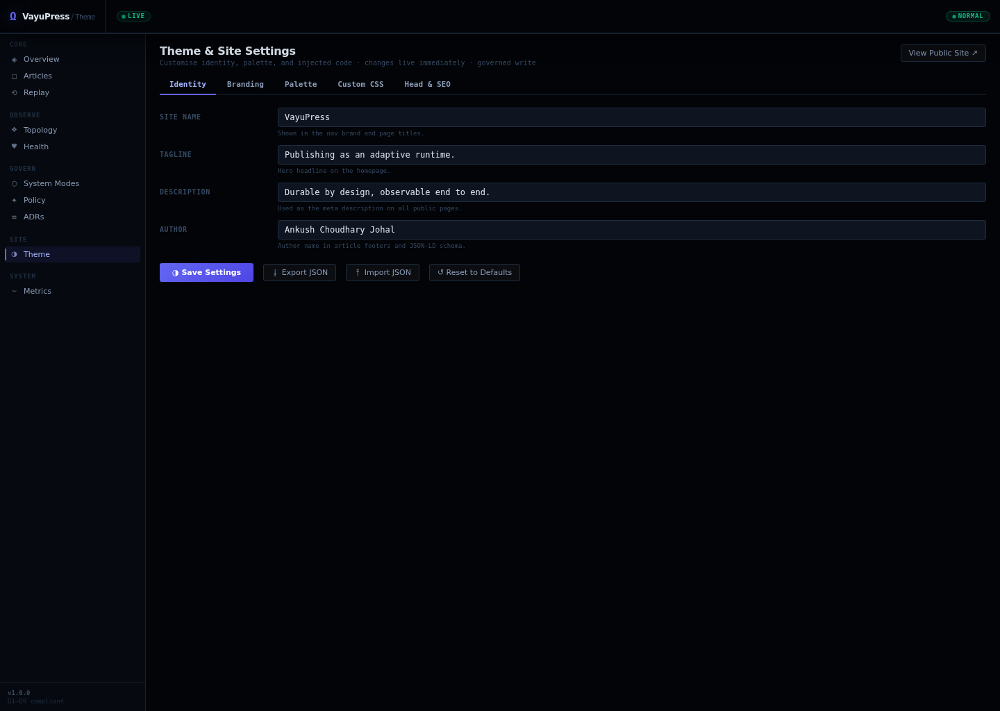

<p align="center">
  <picture>
    <source media="(prefers-color-scheme: dark)"  srcset="docs/assets/vayupress-logo-light.png">
    <source media="(prefers-color-scheme: light)" srcset="docs/assets/vayupress-logo.png">
    
  </picture>
</p>

# VayuPress

[](https://github.com/johalputt/vayupress/actions/workflows/ci.yml)
[](https://github.com/johalputt/vayupress/actions/workflows/security.yml)
[](https://go.dev/)
[](LICENSE)
[](GOVERNANCE-CONSTITUTION.md)

> **Adaptive publishing infrastructure for the sovereign web.**
> SQLite-first, zero-trust, zero telemetry. Policy-governed runtime with adaptive system modes, sandboxed plugins, transactional event outbox, durable audit trail, and fault-tolerant federated publishing.

## Platform Screenshots

> Screenshots are regenerated automatically from a live instance by the
> [screenshots CI workflow](.github/workflows/screenshots.yml) and committed
> back to `docs/screenshots/`. Run it via **GitHub → Actions → screenshots → Run workflow**.

### Public Homepage


*Public homepage — article grid with tag filtering, dark/light mode toggle, zero-telemetry footer, system mode indicator. Styled on vendored Pico CSS served locally to keep the strict `style-src 'self'` CSP intact.*

### Article Page


*Rendered article — JSON-LD schema, author/date meta, tag strip, reading time, zero third-party requests.*

---

### Admin Dashboard


*Runtime governance console — system mode (Normal/Degraded/ReadOnly/Recovery/Maintenance/Quarantined), SLO error budgets with contributor attribution, dependency health grid, kernel invariant checklist, operational timeline with epistemic confidence annotations.*

### Theme & Site Settings Control Panel


*Theme console — identity fields, palette editor with live hex+swatch sync and WCAG AA contrast advisory, custom CSS (16 KB, served same-origin via `/theme.css`), declarative `<head>` capabilities, and custom favicon/logo upload (PNG/ICO, magic-number validated, stored in the database). Themes round-trip as a portable JSON bundle via **Export / Import**, and a one-click **Reset to Defaults** restores the factory palette. The public site ships a self-hosted **dark/light mode toggle** (no third-party fonts or scripts — `script-src 'self'`). All changes are mode-gated, CSRF-protected governed writes.*

### System Modes & Policy Engine


*Platform control plane — 6 adaptive system modes with validated transition graph, append-only mode history, and all registered policies with live pass/warn/fail status.*

### Policy Provenance Inspector (Ω11)


*Live policy evaluation table — per-policy category/severity/result strip, run-history trend, and persistent evaluation log for provenance and trend analysis.*

### Runtime Topology (Ω9)


*Interactive operator console — 17-node live runtime graph (write path, delivery/read, governance, observability) with health derived in real time from failed-job counts, current mode, and fault-escalation state.*

### Replay Explorer (Ω10)


*Write-job lifecycle inspector — dead-letter & poison-queue surface with single-job and batch requeue, full lifecycle chain (pending → processing → completed → retry ×3 → dead-letter → replay ×3 → quarantined).*

### Fault Manager


*Fault escalation surface — active faults with severity level, trigger source, and escalation path through the mode state machine.*

### ADR Registry


*Architecture Decision Records — every design decision indexed with status, date, and rationale. Governance documentation lives in the running system, not a separate wiki.*

---

## Quick Start

```bash
curl -sSL https://raw.githubusercontent.com/johalputt/vayupress/main/scripts/deploy-vayupress.sh | bash
```

Or clone and deploy manually:

```bash
git clone https://github.com/johalputt/vayupress.git
cd vayupress
sudo ./scripts/deploy-vayupress.sh
```

---

## What Is VayuPress?

VayuPress ("Vayu" — Sanskrit for wind/speed) is governed publishing infrastructure for developers, writers, and AI-assisted content engines who need:

- **Adaptive runtime governance** — policy-driven system modes (Normal/Degraded/ReadOnly/Recovery/Maintenance/Quarantined) with validated transition graph and operational convergence
- **Single-VPS efficiency** — runs on 12 GB RAM / 6 vCPU / 250 GB NVMe
- **Total control** over content, hosting, and data
- **No vendor lock-in** — SQLite, Go, Nginx, open standards only
- **Zero telemetry** — no tracking, no analytics harvesting, no third-party calls
- **Platform-kernel integrity** — immutable signing, migration integrity, identity model, event durability, and audit trail enforced by the policy engine
- **Security-first** — sandboxed subprocess plugins, capability enforcement, SSRF protection, durable replay protection, WORM audit log
- **Full observability** — structured JSON logging, distributed tracing, SLO error budgets, fault injection framework

---

## Architecture Overview

```
                     +----------------------------------+
                     |           Internet               |
                     +---------------+------------------+
                                     | HTTPS (443)
                     +---------------v------------------+
                     |    Nginx (TLS termination,        |
                     |    static files, gzip, CSP)       |
                     +---------------+------------------+
                                     | HTTP (127.0.0.1:8080)
             +---------------------------v------------------------------+
             |                VayuPress Go Binary                       |
             |                                                           |
             |  ┌─────────────────────────────────────────────────┐    |
             |  │            Platform Kernel (immutable)           │    |
             |  │  signing · migrations · did · outbox · policy   │    |
             |  │  slo · mode · audit                             │    |
             |  └─────────────────────────────────────────────────┘    |
             |                                                           |
             |  ┌──────────┐  ┌──────────┐  ┌────────────────────┐    |
             |  │  Router  │  │  Plugin  │  │   Write Queue      │    |
             |  │  (chi)   │  │  Pool    │  │   (async workers)  │    |
             |  └────┬─────┘  └────┬─────┘  └─────────┬──────────┘    |
             |       │              │                   │               |
             |  ┌────▼──────────────▼───────────────────▼──────────┐  |
             |  │              SQLite (WAL mode)                    │  |
             |  │  articles · media · write_jobs · audit_log        │  |
             |  │  outbox_events · delivered_events · replay_store  │  |
             |  └───────────────────────────────────────────────────┘  |
             |                                                           |
             |  Lifecycle Manager → Outbox Relay → Event Bus            |
             |  Policy Engine → System Modes → Subsystem Hooks          |
             |  Resource Watchdog → Sandbox Pool → Subprocess IPC       |
             +---------------------------+------------------------------+
                                         |
              +--------------------------+---------------------------+
              |                          |                           |
   +----------v----------+  +-----------v---------+  +-------------v------+
   |  Meilisearch        |  |  Isso               |  |  fail2ban / UFW    |
   |  (optional search)  |  |  (self-hosted       |  |  (firewall)        |
   |  <50ms p95          |  |   comments)         |  |                    |
   +---------------------+  +---------------------+  +--------------------+
```

---

## Platform Kernel

VayuPress has an **immutable platform kernel** — components that define invariants no plugin, extension, or subsystem can bypass. Changes require an RFC and 2/3 supermajority vote.

| Component | Package | Invariant |
|-----------|---------|-----------|
| **Signing** | `internal/signing` | Every published article has a valid Ed25519 signature |
| **Capability Enforcement** | `internal/sandbox` | Plugin capabilities checked against manifest before every Invoke() |
| **Migration Integrity** | `internal/migrations` | Checksums verified against embedded SQL; drift is a hard error |
| **Identity Model** | `internal/did` | DID:key authentication; no shared-secret fallback |
| **Event Durability** | `internal/outbox` | Events written to outbox in same transaction as state change |
| **Audit Trail** | `internal/migrations` (journal) | Migration journal is append-only; no entry may be deleted |
| **SLO Error Budget** | `internal/slo` | BudgetExhausted() blocks the release gate |
| **Policy Engine** | `internal/policy` | All governance policies registered here; no ad hoc enforcement |

See [docs/architecture/kernel-boundary.md](docs/architecture/kernel-boundary.md) for the full kernel boundary specification.

---

## System Modes

VayuPress operates in one of six adaptive system modes, governed by the policy engine:

| Mode | Trigger | Effect |
|------|---------|--------|
| `normal` | Default | All subsystems fully operational |
| `degraded` | SLO error budget exhausted | Feature work pauses; writes allowed |
| `read-only` | Migration checksum drift | Writes refused; recovery required |
| `recovery` | Active recovery operation | Migration apply allowed; writes blocked |
| `maintenance` | Operator-initiated | Planned downtime; controlled shutdown |
| `quarantined` | Plugin quarantine threshold | Plugin and federation suspended |

Transitions are validated against a deterministic graph. Every transition is logged to an append-only history. Policy evaluation drives automatic transitions; operators can force transitions via CLI.

See [docs/architecture/system-modes.md](docs/architecture/system-modes.md).

---

## Internal Package Architecture

| Package | Role |
|---------|------|
| `cmd/vayupress` | Bootstrap, route wiring, graceful shutdown |
| `internal/ai` | Local embedding, semantic search, policy-governed inference |
| `internal/api` | ArticleService, repository pattern, typed domain errors |
| `internal/archcheck` | AST-level architecture validator (import rules, global state, shared abstractions) |
| `internal/auth` | JWT, CSRF, Argon2id hashing, rate-limit buckets |
| `internal/cluster` | Leader election, node coordination |
| `internal/compat` | Compatibility golden tests for Stable contract verification |
| `internal/config` | Env-driven config, version compatibility validation |
| `internal/db` | SQLite init, WAL checkpoint, migrations via `embed.FS` |
| `internal/did` | DID:key authentication with Ed25519 |
| `internal/events` | Typed event structs, Envelope, Bus, idempotent dispatch |
| `internal/fault` | Fault injection framework — named probabilistic fault points |
| `internal/federation` | ActivityPub inbox/outbox, replay protection, adversarial hardening |
| `internal/governance` | RFC voting, supermajority enforcement |
| `internal/graph` | Merkle tree content integrity |
| `internal/health` | Structured health contracts (`/health/*` endpoints) |
| `internal/httputil` | WriteJSON, WriteError, DecodeJSON — thin HTTP primitives |
| `internal/lifecycle` | Ordered startup/shutdown with named phases |
| `internal/logging` | Structured JSON logging with correlation/causation fields |
| `internal/merkle` | SHA-256 Merkle tree for article content proofs |
| `internal/metrics` | Atomic metric counters, snapshot collection |
| `internal/migrations` | Migration engine with dry-run, checksum verification, journal, rollback |
| `internal/mode` | System Mode state machine — policy-driven adaptive runtime |
| `internal/outbox` | Transactional outbox relay — poll + dispatch event envelopes |
| `internal/plugins` | Hook registry, worker pool, subprocess plugin management |
| `internal/policy` | Platform Policy Engine — architecture/security/reliability/release governance |
| `internal/profiling` | Rate-limited pprof, health fingerprints, goroutine leak detection |
| `internal/queue` | SQLite-backed async write queue, dead-letter replay |
| `internal/registry` | Plugin manifest registry |
| `internal/render` | Article renderer, cache writer, CSS asset generator |
| `internal/resource` | Semaphore-based concurrency limiters, resource watchdog |
| `internal/sandbox` | Subprocess IPC pool, Linux seccomp/namespaces, capability enforcement |
| `internal/search` | FTS5 + semantic search, Meilisearch client, sharded index |
| `internal/signing` | Ed25519 article signing and verification |
| `internal/slo` | SLO error budget tracking — rolling windows, exhaustion signals |
| `internal/storage` | Content-addressed storage, IPFS stubs |
| `internal/testutil` | Shared test helpers |
| `internal/trace` | Span-based tracing with correlation/causation IDs |
| `internal/ws` | WebSocket/SSE hub for real-time event streaming |

---

## Feature List (P1–P27 + Ω1–Ω11)

### Core Publishing (P1–P8)
- RESTful JSON API for articles (CRUD with slugs, tags, full-text content)
- Async write queue — SQLite-backed, crash-safe, with dead-letter replay
- Sitemap XML, RSS feed, and robots.txt auto-generation
- In-memory render cache with static-file output via Nginx
- SQLite WAL mode with adaptive checkpointing
- Migration checksum drift detection — halts startup on tampering
- Immutable WORM audit log via SQLite `ABORT` triggers
- Plugin hook system with worker pool, panic recovery, and circuit-breaker disable

### Security & Governance (P9–P13)
- Automated CI governance — 15+ CI jobs, `ci-pass` gate
- Supply-chain secret scanning (TruffleHog), license compliance, shell linting
- Structured health contracts: `/health/live`, `/health/ready`, `/health/dependencies`, `/health/storage`, `/health/search`, `/health/queue`
- `/health/ethics` — machine-readable ethics compliance endpoint
- Ethical AI Charter in `ETHICS.md` (no training on user data, no telemetry)

### Multi-Package Architecture (P14–P19)
- 35+ `internal/` packages with compiler-enforced boundaries
- `App` struct owns all mutable runtime state — no package-level globals
- Repository pattern: `ArticleRepo` interface backed by SQLite
- Integration test harness with `go test -race ./...`

### Event-Driven Reliability (P20–P22)
- Transactional outbox — events written atomically with article mutations
- `lifecycle.Manager` — ordered startup/shutdown with registered components
- Typed event structs with versioned schemas (`article.created.v1`)
- Idempotent dispatch via `delivered_events` deduplication table

### Observability & Tracing (P22–P23)
- Structured JSON logging with `LogFields` — correlation/causation IDs on every line
- Span-based tracing: `Start`, `SetAttribute`, `End`
- SLO error budgets with rolling windows — 5 production SLOs tracked

### Resource Governance & Sandboxing (P24–P26)
- Named semaphore limiters (`articles.write`, `plugin.exec`)
- Subprocess IPC pool for out-of-process plugin execution
- Linux seccomp filtering and namespace isolation for subprocess plugins
- Capability enforcement — subprocess plugins run with dropped privileges

### Platform Stewardship (Ω1–Ω5)
- **Security audit corpus** — 6 security documents (attack surfaces, trust model, incident response, federation threats, sandbox boundaries, signing model)
- **Compatibility contracts** — stability matrix for 30+ packages, golden tests for Stable API contracts
- **Architecture governance** — bounded-context rules, ADR index (23 ADRs), import-layer validator
- **Migration resilience** — dry-run, checksum verification, append-only journal, rollback simulation
- **Federation adversarial hardening** — malformed payload rejection, SQLite-durable replay protection
- **Platform Policy Engine** — 6 canonical policies (architecture, security, reliability, release) unified under `internal/policy`
- **WAL concurrency** — stress tests verifying write serialisation and busy-timeout behaviour
- **Kernel boundary document** — immutable vs replaceable component classification
- **System Modes** — 6-mode adaptive state machine with validated transition graph, policy-driven automatic transitions, and subsystem hook registry
- **Fault injection framework** — named probabilistic fault points with deterministic replay for adversarial testing

### Operational Cognition & Operator Console (Ω6–Ω11)
- **Ω6 — Durable mode journal** — every system-mode transition persisted to SQLite with cause attribution; survives restart
- **Ω7 — Kernel/trace/event/fault panels** — live runtime introspection surfaces on the admin dashboard
- **Ω8 — Unified Operational Timeline** — single causal narrative correlating mode transitions, faults, escalations, and queue events with relative + wall-clock time
- **Ω9 — Interactive operator console** — real control-plane pages that mutate live runtime state:
  - **System Mode Engine** (`/admin/modes`) — drive transitions through the validated graph; invalid moves rejected 409
  - **Fault Engine** (`/admin/faults`) — operator-driven fault simulation feeding the escalation threshold
  - **Runtime Topology** (`/admin/topology`) — 17-node live health graph
- **Ω10 — Live-streaming timeline + Replay Explorer** — animated causal arrows, STREAMING poller, and a dead-letter / poison-queue inspector (`/admin/replay`) with single-job and batch requeue
- **Ω11 — Policy Provenance Inspector** (`/admin/policy`) — SQLite-journaled policy evaluations (`policy_evaluations` table), live pass/warn/fail status, run-history trend sparkline, and a persistent provenance log of every policy run

### Theme & Site Settings Control Panel (`/admin/theme`)

A governed customisation surface — every input is validated, no raw markup is
trusted, and the strict CSP stays intact:

- **Identity** — site name, tagline, meta description, author. Baked into every
  public page; a save triggers a full rendered-cache purge so changes propagate.
- **Palette** — light/dark primary + accent colours (hex-validated). Rendered as
  Pico CSS-variable overrides and served same-origin at **`/theme.css`** (ETag +
  short max-age) — never inlined, so `style-src 'self'` holds. The first-deploy
  defaults match the vendored `custom.css`, so there is no flash-of-unstyled-content.
- **Custom CSS** — operator stylesheet, 16 KB cap, folded into `/theme.css`.
  Cannot reach external origins or execute scripts (CSP-contained).
- **Head & SEO** — *declarative, allowlisted* capabilities (keywords, theme-color,
  robots, Google/Bing verification) rendered to escaped `<meta>` tags. Raw `<head>`
  HTML is intentionally **not** accepted — meta-refresh redirects, external
  beacons, and `<base>` hijacks are structurally impossible, not merely filtered.
- **Storage & safety** — persisted in the `site_settings` table (migration 006,
  content-checksummed like every migration); writes are CSRF-protected, blocked in
  `read-only`/`quarantined` modes, and audit-logged (`component: "theme"`).
- **Public theme toggle** — a sun/moon switch in the site header persists the
  reader's choice in `localStorage`; served as a same-origin script so it needs no
  CSP nonce (which cached HTML cannot carry).
- **CSP telemetry** — violations report to `POST /csp-report`, incrementing
  `vayupress_csp_violations_total` and logging the offending directive, so runtime
  CSP drift is observable rather than silent.

---

## API Endpoints Overview

| Method | Path | Description |
|--------|------|-------------|
| `GET` | `/api/articles` | List articles (paginated, filterable by tag) |
| `POST` | `/api/articles` | Create article (async write queue) |
| `GET` | `/api/articles/{slug}` | Get article by slug |
| `PUT` | `/api/articles/{slug}` | Update article |
| `DELETE` | `/api/articles/{slug}` | Delete article |
| `GET` | `/api/search?q=...` | Full-text search (Meilisearch or SQLite fallback) |
| `GET` | `/health/live` | Liveness probe |
| `GET` | `/health/ready` | Readiness probe |
| `GET` | `/health/dependencies` | Dependency health (DB, search, queue) |
| `GET` | `/health/storage` | Storage quota and utilization |
| `GET` | `/health/search` | Meilisearch status and circuit-breaker state |
| `GET` | `/health/queue` | Write queue depth and worker stats |
| `GET` | `/health/ethics` | Machine-readable ethics compliance |
| `GET` | `/sitemap.xml` | Auto-generated XML sitemap |
| `GET` | `/feed.xml` | Auto-generated RSS feed |
| `GET` | `/robots.txt` | Auto-generated robots.txt |
| `GET` | `/api/v1/openapi.json` | OpenAPI 3.0 description of the API (embedded, public) |
| `GET` | `/metrics` | Internal metrics snapshot (admin auth required) |

### Operator console (admin auth required)

| Method | Path | Description |
|--------|------|-------------|
| `GET` | `/admin` | Runtime governance dashboard + Unified Operational Timeline |
| `GET` | `/admin/modes` | System Mode Engine — drive validated mode transitions |
| `GET` | `/admin/faults` | Fault Engine — operator-driven fault simulation |
| `GET` | `/admin/topology` | Runtime Topology — 17-node live health graph |
| `GET` | `/admin/replay` | Replay Explorer — dead-letter & poison queue |
| `GET` | `/admin/policy` | Policy Provenance Inspector — journaled evaluations |
| `GET` | `/admin/theme` | Theme & Site Settings control panel |
| `POST` | `/admin/theme` | Save theme/identity settings (CSRF-protected) |
| `POST` | `/admin/mode/transition` | Transition system mode (CSRF-protected) |
| `POST` | `/admin/fault/simulate` | Fire a named fault (CSRF-protected) |
| `POST` | `/admin/replay/job` | Requeue a single dead-letter job (CSRF-protected) |
| `POST` | `/admin/benchmark` | Run the in-process load benchmark (CSRF-protected) |
| `GET` | `/api/v1/admin/severity` | Formal operational severity taxonomy (self-documenting) |
| `GET` | `/api/v1/admin/budgets` | Governance error-budget state + recommended escalation |
| `GET` | `/api/v1/admin/search/drift` | Search-index vs article-store drift report |
| `POST` | `/admin/search/reindex` | Rebuild the search index from the store (CSRF-protected) |

Public theming endpoints (no auth): `GET /theme.css` (operator palette + custom
CSS, served same-origin for CSP), `GET /static/js/theme-toggle.js` (sun/moon
switcher), `POST /csp-report` (CSP violation telemetry → `vayupress_csp_violations_total`).

Full reference: [docs/API-REFERENCE.md](docs/API-REFERENCE.md)

---

## Companion Tools

Standalone migration and import tools live under [`tools/`](tools/). Each is an
independent Go module — builds without pulling in the engine.

### Migration Tools

| Tool | Migrates from | Source |
|------|--------------|--------|
| **ghost-to-vayu** | Ghost CMS (MySQL or SQLite direct DB) | [`tools/ghost-to-vayu`](tools/ghost-to-vayu) |
| **wordpress2vayu** | WordPress MySQL — posts, pages, categories, tags, featured images | [`tools/wordpress2vayu`](tools/wordpress2vayu) |
| **hugo2vayu** | Hugo Markdown sites (YAML + TOML frontmatter) | [`tools/hugo2vayu`](tools/hugo2vayu) |
| **jekyll2vayu** | Jekyll `_posts` (YAML frontmatter, date-in-filename) | [`tools/jekyll2vayu`](tools/jekyll2vayu) |
| **substack2vayu** | Substack `posts.csv` export | [`tools/substack2vayu`](tools/substack2vayu) |
| **notion2vayu** | Notion HTML export (ZIP or directory) | [`tools/notion2vayu`](tools/notion2vayu) |
| **medium2vayu** | Medium HTML export (ZIP or directory) | [`tools/medium2vayu`](tools/medium2vayu) |
| **markdownfolder2vayu** | Any folder of Markdown files with YAML frontmatter | [`tools/markdownfolder2vayu`](tools/markdownfolder2vayu) |

All migration tools share the same design: direct source access (no API keys needed), keyset pagination, throttled batching, checkpoint/resume, and idempotent `INSERT OR IGNORE` writes.

### Operational Tools

| Tool | Purpose | Source |
|------|---------|--------|
| **vayu-backup** | Compress, verify, and restore VayuPress SQLite databases | [`tools/vayu-backup`](tools/vayu-backup) |
| **vayu-export** | Render all articles to a static HTML site for CDN or archiving | [`tools/vayu-export`](tools/vayu-export) |
| **vayu-validate** | Content integrity checker — slug validity, duplicates, bad dates, oversized content | [`tools/vayu-validate`](tools/vayu-validate) |

```bash
# Migrate from Ghost
cd tools/ghost-to-vayu && go build -o ghost2vayu ./cmd/ghost2vayu
./ghost2vayu migrate --ghost-driver mysql \
  --ghost-dsn "user:pass@tcp(localhost:3306)/ghost_production" \
  --vayu-db /var/lib/vayupress/vayupress.db

# Import Markdown posts
cd tools/markdownfolder2vayu && go build -o md2vayu ./cmd/md2vayu
./md2vayu import --dir ./posts --vayu-db /var/lib/vayupress/vayupress.db

# Validate after migration (exits 1 on errors — CI-safe)
cd tools/vayu-validate && go build -o vayu-validate ./cmd/vayu-validate
./vayu-validate validate --db /var/lib/vayupress/vayupress.db
```

### Built-in Plugin Features

These features are part of VayuPress core (no external service required):

| Feature | Package | API |
|---------|---------|-----|
| **SEO Optimizer** | `internal/seo` | Auto OpenGraph, Twitter Card, JSON-LD per article |
| **Comments** | `internal/comments` | `POST /api/v1/articles/{slug}/comments` + moderation |
| **Article Versions** | `internal/versions` | `GET /api/v1/admin/articles/{slug}/versions` |
| **Series/Collections** | `internal/collections` | `GET/POST /api/v1/collections` |
| **Newsletter** | `internal/newsletter` | `POST /api/v1/newsletter/subscribe` |
| **Webmentions** | `internal/webmention` | `POST /webmention` (W3C receiver) |
| **Draft Preview Links** | `internal/preview` | `POST /api/v1/admin/preview` |
| **Redirect Manager** | `internal/redirects` | `GET/POST /api/v1/admin/redirects` |
| **Table of Contents** | `internal/toc` | `GET /api/v1/articles/{slug}/toc` |
| **ActivityPub / Federation** | `internal/federation` | Outbox relay + HTTP Signatures |
| **Spam Guard** | `internal/spam` | Comment classification middleware |
| **Content Signing** | `internal/signing` | HMAC article verification |
| **Sovereign Self-Update** | `internal/update` | Check-only web API + signature-verified CLI apply |

### Modern Admin UI (`/admin/v2`)

An editor-first admin redesign on a fully vendored, CSP-compliant stack (no
CDNs, no `unsafe-eval`) — served alongside the untouched legacy `/admin`. The
editor has split-view live preview, a slash-command palette, distraction-free
mode, word count / reading time, an SEO preview, debounced autosave, and version
history. See [docs/ADMIN-UI.md](docs/ADMIN-UI.md) and
[ADR-0065](docs/adr/ADR-0065-admin-ui-csp-compliant-stack.md).

### Self-Update

VayuPress can check for and apply its own updates **sovereignly and safely**:

```bash
vayupress update check               # read-only version/changelog check
vayupress update apply --dry-run     # verify checksum + Ed25519 signature, change nothing
vayupress update apply               # gated, signed, backed-up binary swap (CLI-only)
```

The web panel can only *check* (`GET /admin/api/updates/check`). Applying an
update is **CLI-only**, requires opt-in (`VAYU_SELFUPDATE_ENABLED=true`) and an
operator-pinned Ed25519 key (`VAYU_RELEASE_PUBKEY`), is refused in
read-only/quarantine/maintenance mode, backs up the database first, and never
auto-restarts. See [docs/UPGRADING.md](docs/UPGRADING.md),
[docs/SECURITY.md](docs/SECURITY.md), and
[ADR-0064](docs/adr/ADR-0064-sovereign-self-update.md).

---

## Requirements

| Requirement | Detail |
|-------------|--------|
| Go | 1.23+ (build from source; deploy script installs 1.25) |
| CGO / SQLite3 | `gcc` required (`libsqlite3-dev` or bundled via `go-sqlite3`) |
| OS | Ubuntu 24.04 LTS (recommended); Linux kernel 5.x+ for sandbox features |
| RAM | 8 GB minimum, 12 GB recommended |
| CPU | 4 vCPU minimum, 6 vCPU recommended |
| Disk | 50 GB NVMe minimum, 250 GB for 1M+ posts with media |
| Access | Root or sudo for deploy script |

---

## Deployment

### Automated (recommended)

```bash
# Download and run the deploy script
curl -sSL https://raw.githubusercontent.com/johalputt/vayupress/main/scripts/deploy-vayupress.sh | bash

# Dry-run first (inspect what will be installed)
bash scripts/deploy-vayupress.sh --dry-run

# Upgrade an existing installation
bash scripts/deploy-vayupress.sh --upgrade
```

The deploy script handles: Go toolchain, CGO/SQLite3, binary build, Nginx with TLS and CSP, systemd service, Meilisearch (optional), nightly backup cron, fail2ban rules.

### Manual Build

```bash
git clone https://github.com/johalputt/vayupress.git
cd vayupress
go build -race ./...                                   # development build
go build -ldflags="-s -w" -trimpath ./cmd/vayupress   # production binary
```

---

## Development Setup

```bash
git clone https://github.com/johalputt/vayupress.git
cd vayupress

go build ./...          # build all packages
go test -race ./...     # full test suite with race detector
go vet ./...            # static analysis
gofmt -l .              # format check

make build test lint    # all-in-one
```

### Environment Variables

| Variable | Default | Description |
|----------|---------|-------------|
| `VAYU_DOMAIN` | `localhost` | Public domain name |
| `VAYU_PORT` | `8080` | HTTP listen port |
| `VAYU_DB_PATH` | `/var/lib/vayupress/vayupress.db` | SQLite database path |
| `VAYU_WORKER_COUNT` | `4` | Write queue worker goroutines |
| `VAYU_PLUGINS_ENABLED` | `false` | Enable plugin worker pool |
| `VAYU_PLUGIN_TIMEOUT_MS` | `2000` | Per-hook execution timeout |
| `VAYU_PLUGIN_MAX_CONCURRENT` | `8` | Max concurrent plugin executions |
| `STATIC_DIR` | `/var/www/vayupress/static` | Static asset output directory |
| `MEILI_URL` | `http://127.0.0.1:7700` | Meilisearch base URL |
| `MEILI_MASTER_KEY` | — | Meilisearch master key |

---

## Repository Structure

```
vayupress/
├── cmd/vayupress/          # Application entry point
│   ├── main.go             # Bootstrap, graceful shutdown, lifecycle wiring
│   ├── app.go              # App struct owning all mutable runtime state
│   ├── routes.go           # Route registration
│   ├── handlers_articles.go
│   ├── handlers_infra.go
│   ├── handlers_admin.go
│   └── middleware.go
├── internal/               # 35+ domain packages (compiler-enforced boundaries)
│   ├── archcheck/          # AST-level architecture validator
│   ├── compat/             # Compatibility golden tests
│   ├── fault/              # Fault injection framework
│   ├── federation/         # ActivityPub + replay protection
│   ├── migrations/         # Migration engine with resilience
│   ├── mode/               # System Mode state machine
│   ├── policy/             # Platform Policy Engine
│   ├── profiling/          # pprof + health fingerprints
│   ├── sandbox/            # Subprocess IPC, seccomp, capability enforcement
│   ├── signing/            # Ed25519 article signing
│   ├── slo/                # SLO error budget tracking
│   └── ...                 # (full list in package table above)
├── docs/
│   ├── adr/                # Architecture Decision Records (ADR-0001…ADR-0062)
│   ├── architecture/       # Bounded contexts, kernel boundary, system modes
│   ├── compatibility/      # Stability matrix, API contracts
│   ├── security/           # Attack surfaces, trust model, incident response
│   ├── reliability/        # SLOs, error budgets
│   ├── operations/         # WAL recovery, backup/restore runbooks
│   ├── release/            # Release gate checklist
│   └── ...
├── testdata/
│   ├── bench/              # Committed benchmark baselines
│   └── golden/             # Golden test files for Stable API contracts
├── scripts/
│   ├── deploy-vayupress.sh # Canonical self-contained installer
│   └── sync-source.sh      # Source integrity check
├── go.mod / go.sum
├── Makefile
├── GOVERNANCE-CONSTITUTION.md
├── CHANGELOG.md
├── SECURITY.md
├── ETHICS.md
└── CONTRIBUTING.md
```

---

## Performance

Target: ≤50 ms p95 latency on a 4-vCPU VPS under sustained load.

### Measured — end-to-end load (built-in benchmark harness)

Real numbers from the in-process load benchmark (`POST /admin/benchmark`) on a
**4-vCPU Intel Xeon @ 2.80 GHz, 16 GB** box, SQLite in WAL mode, 20 concurrent
readers against the cached render path:

| Metric | Measured | Target | Result |
|--------|----------|--------|--------|
| Read p50 | **16 ms** | — | — |
| Read p95 | **16 ms** | <50 ms | ✅ PASS |
| Read p99 | **16 ms** | <50 ms | ✅ PASS |
| Read throughput | **~8,700 RPS** | — | — |
| Read mean | **8.2 ms** | — | — |

### Measured — micro-benchmarks (`go test -bench`)

| Operation | Package | ns/op | allocs/op |
|-----------|---------|------:|----------:|
| Ed25519 sign | `internal/signing` | **28,423** (28.4 µs) | 7 |
| Ed25519 verify | `internal/signing` | **64,133** (64.1 µs) | 4 |
| Article input validation | `internal/api` | **234** | 0 |
| Slug validation | `internal/api` | **384** | 0 |
| Migration apply (full) | `internal/migrations` | **142,151** (142 µs) | 102 |
| Event schema validate | `internal/events/schema` | **196** | 0 |
| Merkle proof generation | `internal/merkle` | **1,403** | 20 |
| Histogram record (metrics) | `internal/metrics` | **18.3** | 0 |
| Cache hit-ratio read | `internal/metrics` | **0.46** | 0 |

Hot-path validation and metrics are **zero-allocation**. Reproduce with:

```bash
make bench                                  # committed baselines
go test -bench=. -benchmem -run=^$ ./...    # full micro-benchmark sweep
curl -X POST -H "X-API-Key: $KEY" .../admin/benchmark   # live end-to-end load
```

| Static metric | Value | Mechanism |
|---------------|-------|-----------|
| Cold start | <500 ms | Single static binary |
| Production binary | `-ldflags="-s -w" -trimpath` | Stripped, reproducible |
| Article page serving | Nginx static + in-memory render cache | No per-request render |

---

## Governance

VayuPress is governed by the [VayuPress Governance Constitution v6.0](GOVERNANCE-CONSTITUTION.md).

**Priority order (non-negotiable):**
Security = Data Integrity > Ethical Compliance > Reliability > Simplicity > Performance > DX > Feature Velocity

All governance policies are enforced by the Platform Policy Engine (`internal/policy`) and validated in CI on every push.

---

## Key Documents

| Document | Description |
|----------|-------------|
| [Kernel Boundary](docs/architecture/kernel-boundary.md) | Immutable kernel components and bypass prohibition |
| [System Modes](docs/architecture/system-modes.md) | Adaptive runtime mode specification |
| [Bounded Contexts](docs/architecture/bounded-contexts.md) | Package layer rules and prohibited coupling |
| [Stability Matrix](docs/compatibility/stability-matrix.md) | Stable/Beta/Experimental contract classification |
| [SLOs](docs/reliability/slos.md) | Production SLOs and error budget policy |
| [Release Gate](docs/release/release-gate.md) | Mandatory release checklist |
| [Security](SECURITY.md) | Vulnerability disclosure policy |
| [Ethics](ETHICS.md) | Ethical principles and AI charter |
| [ADR Index](docs/adr/INDEX.md) | Full Architecture Decision Record index |
| [API Reference](docs/API-REFERENCE.md) | REST API reference |
| [OpenAPI Spec](cmd/vayupress/openapi.json) | Machine-readable OpenAPI 3.0 (served at `/api/v1/openapi.json`) |
| [Plugins Guide](docs/plugins/README.md) | Sandbox IPC protocol, manifests, example plugins |
| [Monitoring](deploy/monitoring/README.md) | Prometheus alert rules + Grafana dashboard |
| [Upgrading](UPGRADING.md) | Upgrade procedure + schema/migration authoring |
| [Benchmarks](docs/BENCHMARKS.md) | Measured performance + reproduction steps |

---

## Contact

| Purpose | Email |
|---------|-------|
| General | hello@vayupress.com |
| Support | support@vayupress.com |
| Security | security@vayupress.com |
| Ethics | ethics@vayupress.com |
| Governance / RFCs | governance@vayupress.com |

---

## License

MIT — see [LICENSE](LICENSE).

> *"Stay lightweight. Stay fast. Stay secure. Stay disciplined. Stay ethical."*
