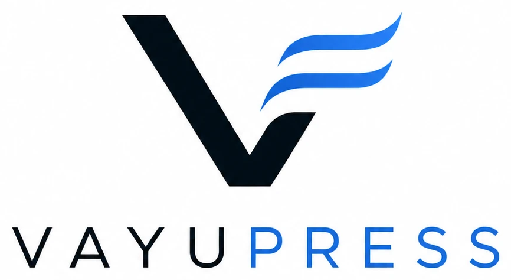

<p align="center">
  <picture>
    <source media="(prefers-color-scheme: dark)"  srcset="docs/assets/vayupress-logo-light.png">
    <source media="(prefers-color-scheme: light)" srcset="docs/assets/vayupress-logo.png">
    
  </picture>
</p>

<h1 align="center">VayuPress</h1>

<p align="center">
  <strong>Your whole online presence — website, blog, and private mail — in one sovereign binary.</strong><br>
  One VPS. One process. One control panel. Zero telemetry, zero vendor lock-in, zero SDKs.
</p>

<p align="center">
  <a href="https://github.com/johalputt/vayupress/actions/workflows/ci.yml"></a>
  <a href="https://github.com/johalputt/vayupress/actions/workflows/security.yml"></a>
  <a href="https://go.dev/"></a>
  <a href="LICENSE"></a>
  
  <a href="GOVERNANCE-CONSTITUTION.md"></a>
</p>

---

## About

**Vayu** is Sanskrit for *wind* — the invisible force that moves everything and is owned by no one. VayuPress moves your online presence the same way: entirely under your control, seen by no third party.

VayuPress began as a publishing engine. It is now a **complete sovereign platform** — a business **website**, a **blog**, and a private **PGP email server** for your own domain, with an official **mobile mail app**, **privacy-first analytics**, and a single admin console (**VayuOS**) — all compiled into **one Go binary** that runs on a single modest VPS.

Point a domain at one server, run one install command, and you get:

- a **website** at `yourdomain.com`,
- a **blog** at `blog.yourdomain.com`,
- a **mail server with automatic PGP** at `mail.yourdomain.com`,

each with a free Let's Encrypt certificate issued and renewed for you. No SaaS bill, no analytics harvesting, no plugin marketplace, no credentials on someone else's cloud. **You own the content, the mailbox, the data, and the machine.**

> *Own your content. Own your communication. Own your infrastructure.*

---

## What you get

### 🌐 A real website
Serve a genuine business site at your domain — **11 elegant, modern-minimalist templates** (restaurant, café, shop, portfolio, agency, school, clinic, salon, gym, professional firm, hotel), edited entirely from VayuOS with live preview. You choose the hosting topology (website at the root or the blog at the root); an update never changes it for you.

### ✍️ A Ghost-class blog
A best-in-class **block editor** with whole-document **Markdown** and **HTML** modes (lossless round-trips), drag/drop/paste images or any `https` link, tables, toggles, task lists, math, callouts, code, self-hosted audio/video, Mermaid diagrams rendered server-side, a slash-command palette, live preview, autosave, and version-history diffs. Whole-site **themes** restyle every surface (nav, hero, feed, article, footer) with a live Theme Studio. Multi-author bylines, memberships, paywalls, newsletters, threaded comments, and SEO baked in.

### 📧 A sovereign PGP mail server (VayuMail)
Your own mail server for your domain — **SMTP send + receive, IMAP and POP3**, RFC-6376 **DKIM signing**, direct-to-MX delivery with STARTTLS, automatic **MX / SPF / DKIM / DMARC** records with live DNS health checks, per-mailbox quotas, junk filtering, and a full webmail surface. **PGP is native and automatic** (VayuPGP): keypairs are generated per account, private keys are AES-256-GCM encrypted at rest, and your public keys are published via **Web Key Directory (WKD)** so any client can find them. Mail never leaves your server unencrypted to a third party.

### 📱 An official mobile app (VayuMail Mobile)
[**johalputt/VayuMail-Mobile**](https://github.com/johalputt/VayuMail-Mobile) — a pure-Go Android app that reads and sends your PGP mail from your own domain. Connect in **one scan**: the admin's rotating setup QR carries a per-device app password (never your real password, revocable anytime), or auto-detect the whole account from just your email address via VayuPress's first-party autoconfig endpoint. No tracking pixels, no remote content, no telemetry.

### 📊 Privacy-first analytics (VayuAnalytics)
Real product analytics — pageviews, sessions, top pages, referrers, UTM campaigns, custom events, funnels, retention, revenue, and a live visitor panel — stored locally in SQLite. Visitor identity is a **server-side daily-rotating salted hash**: no cookies, no `localStorage`, no IP or User-Agent ever stored, **no consent banner required**, nothing to leak on a database compromise. Visitor country is resolved from an **embedded offline table** — no external GeoIP service, no phone-home.

### 🛠️ One control panel (VayuOS)
Everything above is run from a single, fast, strict-CSP admin at `/os` — dashboard, editor, media library, themes, members, newsletter, mail, analytics, SEO, API keys, and one-click **update & encrypted backup**. TOTP two-factor, role-based access, WORM audit log, and an adaptive policy-governed runtime underneath.

---

## Quick start

One command stands up the whole stack — website, blog, and PGP mail — on a fresh VPS:

```bash
curl -sSL https://raw.githubusercontent.com/johalputt/vayupress/main/scripts/deploy-vayupress.sh | bash
```

Or clone and deploy manually:

```bash
git clone https://github.com/johalputt/vayupress.git
cd vayupress
sudo ./scripts/deploy-vayupress.sh
```

The installer provisions the binary, systemd service, Nginx, and Let's Encrypt certificates for your website, blog, and mail hostnames. A fresh install auto-creates an `admin@yourdomain` account (random password, saved to a root-only file) and forces a password change on first sign-in — no extra CLI step.

Runs comfortably on a single **8 GB RAM / 4 vCPU / 50 GB NVMe** VPS.

---

## Why VayuPress

|  | VayuPress | Typical stack |
|---|---|---|
| **What it replaces** | Website builder **+** blog **+** mail provider **+** analytics **+** admin | Four or five separate SaaS bills |
| **Where your data lives** | Your VPS, your SQLite file | Vendor clouds you don't control |
| **Telemetry** | None — verifiable, it's open source | "Anonymized analytics" |
| **Mail** | Your own server, PGP automatic | Google/Microsoft reads the metadata |
| **Tracking of readers** | Cookieless, no PII, no consent banner | Cookies + third-party pixels |
| **Dependencies** | One Go binary + SQLite + Nginx | Node, databases, Redis, queues, SDKs |
| **Extensibility** | Sandboxed, capability-gated plugins | Marketplace plugins with full access |
| **Lock-in** | Open standards, plain export | Proprietary formats, export friction |

---

## One binary, by design

VayuPress is a single Go binary and a single SQLite database. There is no second service to install, secure, or keep alive — search, comments, analytics, mail, and PGP all run in-process.

```text
                         Internet ──HTTPS──▶ Nginx (TLS, static, CSP)
                                                  │ 127.0.0.1:8080
                    ┌─────────────────────────────▼──────────────────────────────┐
                    │                     VayuPress (one Go binary)               │
                    │                                                             │
                    │   Website · Blog · Block editor · Themes · Members          │
                    │   VayuMail (SMTP/IMAP/POP3 · DKIM · MX/SPF/DMARC)           │
                    │   VayuPGP (keys · WKD)   VayuFind (search)   Analytics      │
                    │   VayuOS control panel   Newsletter   Media   API           │
                    │                                                             │
                    │   ── Platform kernel (immutable) ──                         │
                    │   signing · migrations · outbox · policy · modes · audit    │
                    │                                                             │
                    │                    SQLite (WAL mode)                        │
                    └─────────────────────────────────────────────────────────────┘
```

Under the hood: an **immutable platform kernel** (Ed25519 article signing, checksum-verified migrations, transactional event outbox, WORM audit log, a policy engine and six adaptive system modes), an async SQLite write queue with dead-letter replay, sandboxed out-of-process plugins with seccomp + capability enforcement, and full observability (structured logs, tracing, SLO error budgets). Architecture and every decision are recorded in [`docs/`](docs/) and the [ADR registry](docs/adr/).

---

## Showcase

### Website & blog

*Public homepage — article grid with tag filtering, dark/light toggle, zero-telemetry footer. Styled entirely from your own origin (strict `style-src 'self'` CSP).*


*A rendered article — JSON-LD schema, author/date meta, tag strip, reading time, and zero third-party requests.*

### VayuOS — the single control panel

*The dashboard (`/os`) — grouped sidebar, stat cards, publishing-trend sparkline, activity feed, and a `⌘K` command palette.*


*The block editor — typed-block document rendered server-side through escape + bluemonday, slash-command palette, autosave, live preview, and inline version-history diff.*


*Theme Studio (`/os/theme`) — a preset gallery and design-token editor with instant live preview, compiled to one sovereign stylesheet served from your own origin.*


*VayuAnalytics — cookieless, no-PII product analytics computed entirely from your local SQLite database.*

<details>
<summary><strong>More of VayuOS</strong> — posts, media, SEO, security, and the operator control plane</summary>

| | |
|---|---|
|  |  |
| *Post manager with live status pills* | *Content-addressed media library* |
|  |  |
| *SEO readiness dashboard* | *Security & PGP surface (admin-only)* |
|  |  |
| *Strict-CSP, self-hosted sign-in* | *Branded passwordless member signup* |

The adaptive-governance runtime is fully inspectable from inside VayuOS — system modes, the policy provenance inspector, a live runtime-topology graph, the dead-letter replay explorer, the fault manager, and the ADR registry.

| | |
|---|---|
|  |  |
|  |  |

</details>

> Screenshots are regenerated from a live instance by the [screenshots CI workflow](.github/workflows/screenshots.yml).

---

## Security & sovereignty

- **Zero telemetry, zero third-party reader requests.** Strict CSP (no `unsafe-eval`, no `unsafe-inline`, per-request nonces); all assets served same-origin. No CDNs.
- **Encrypted at rest.** PGP private keys and stored third-party secrets are AES-256-GCM encrypted; operator backups are a single AES-256-GCM + Argon2id archive of everything (DB, settings, media, mailboxes, keys).
- **Sandboxed extensibility.** Out-of-process plugins run under seccomp + namespace isolation with deny-by-default capabilities.
- **Governed by construction.** A machine-enforced [Constitution](GOVERNANCE-CONSTITUTION.md), an [Ethical AI Charter](ETHICS.md) (no training on user data, no telemetry), signed releases, and a WORM audit log. AI assistance is strictly opt-in and local-only (Ollama) — nothing leaves your server.

---

## Documentation

- **[CHANGELOG.md](CHANGELOG.md)** — every release and what changed, version by version.
- **[docs/adr/](docs/adr/)** — Architecture Decision Records: every design decision, recorded.
- **[GOVERNANCE-CONSTITUTION.md](GOVERNANCE-CONSTITUTION.md)** — the binding rules, mechanically enforced by CI.
- **[ETHICS.md](ETHICS.md)** — the Ethical AI Charter.
- **[VayuMail-Mobile](https://github.com/johalputt/VayuMail-Mobile)** — the official mobile mail app.

## License

Apache License 2.0 — see [LICENSE](LICENSE).
