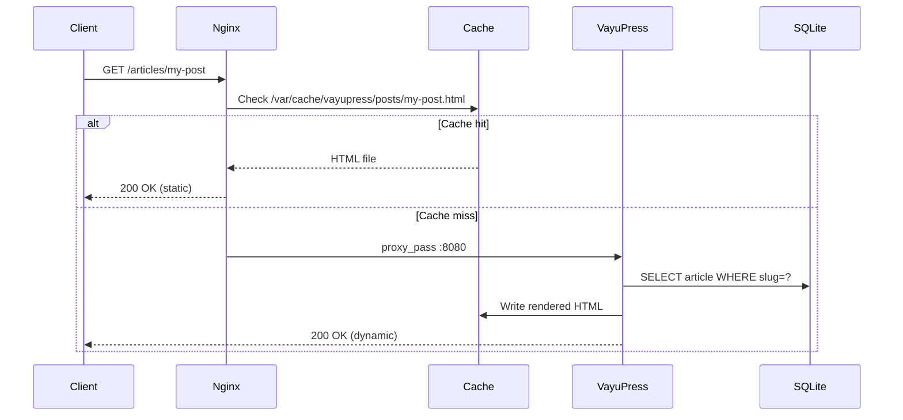
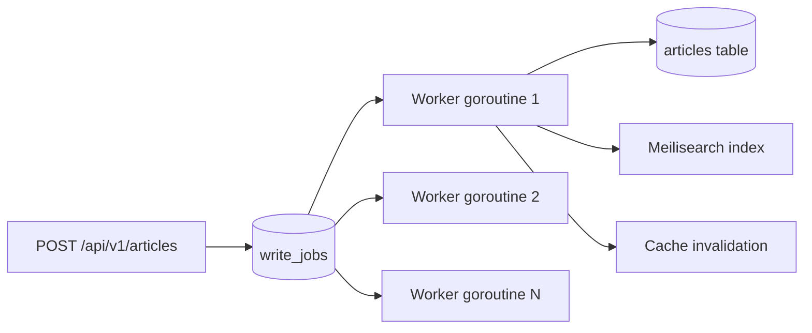
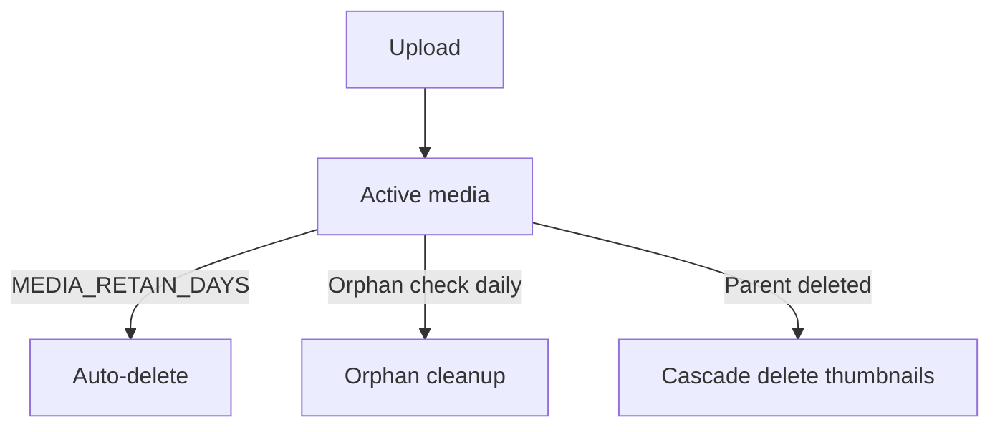
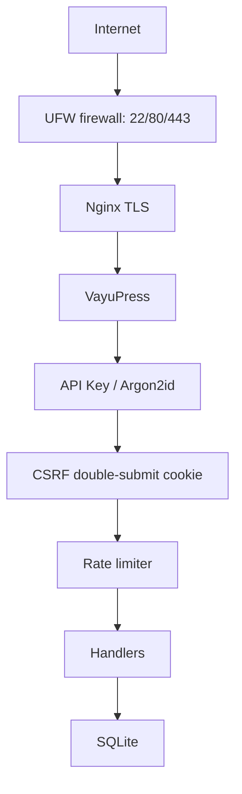

# VayuPress Architecture

## Purpose

VayuPress is a single-binary publishing platform written in Go, using SQLite as its primary database. It is designed to run on a single VPS (12 GB RAM / 6 vCPU / 250 GB NVMe) and serve millions of articles with static-file performance.

## System Context

```mermaid
graph TD
    Client -->|HTTPS| Nginx
    Nginx -->|Cache hit| StaticFiles[/var/cache/vayupress]
    Nginx -->|Cache miss| VayuPress[VayuPress :8080]
    VayuPress --> SQLite[SQLite WAL]
    VayuPress -->|Optional| Meilisearch[Meilisearch :7700]
    VayuPress -->|Optional| Isso[Isso :8081]
    Admin -->|API Key| VayuPress
```

## Components

| Component       | Role                                             | Failure Mode            |
|-----------------|--------------------------------------------------|-------------------------|
| Nginx           | Static-file serving, TLS, reverse proxy          | VayuPress serves directly|
| VayuPress (Go)  | Write queue, cache renderer, admin API           | N/A (primary)           |
| SQLite (WAL)    | Articles, jobs, schema migrations                | No degradation possible |
| Meilisearch     | Full-text search (<50ms p95)                     | Falls back to LIKE queries|
| Isso            | Self-hosted comments                             | Comments unavailable    |

## Request Flow



## Write Queue



Write jobs are persisted in SQLite before any worker processes them. On crash, `pending` jobs resume from where they left off. Jobs that fail 3 times move to the dead-letter queue.

## Media Pipeline

```mermaid
graph LR
    Upload[POST /api/v1/media] --> Validate[MIME + extension check]
    Validate --> Sandbox[libvips seccomp/apparmor]
    Sandbox --> Thumbnails[Thumbnail generation]
    Thumbnails --> Storage[/var/www/vayupress/static/media]
    Thumbnails --> Dedup[SHA-256 deduplication]
```

## Storage Lifecycle



## Security Architecture



## Key Design Decisions

See `/docs/adr/` for Architecture Decision Records.

Key decisions:
- **ADR-0001**: SQLite as primary database (WAL mode)
- **ADR-0002**: Self-hosted fonts (zero telemetry)
- **ADR-0032**: Plugin pool WaitGroup drain
- **ADR-0033**: WAL adaptive checkpoint
- **ADR-0034**: Migration checksum drift detection

## Operational Constraints

| Metric            | Target       | CI Enforcement     |
|-------------------|--------------|--------------------|
| Idle RAM          | < 500 MB     | FAIL if > 800 MB   |
| Peak RAM          | < 2 GB       | FAIL if > 4 GB     |
| Binary size       | < 40 MB      | FAIL if > 45 MB    |
| TTFB (cached)     | < 100 ms p95 | FAIL if > 200 ms   |
| Frontend JS       | < 30 KB gz   | FAIL if > 50 KB    |
| Startup time      | < 2s         | Warn if > 5s       |

## Dependencies

| Package                    | Role                  | License      |
|----------------------------|-----------------------|--------------|
| github.com/go-chi/chi/v5   | HTTP router           | MIT          |
| github.com/mattn/go-sqlite3| SQLite driver         | MIT          |
| github.com/microcosm-cc/bluemonday | HTML sanitizer | BSD-3-Clause |
| github.com/sony/gobreaker  | Circuit breaker       | MIT          |
| github.com/rs/cors         | CORS middleware       | MIT          |
| github.com/yuin/goldmark   | Markdown → HTML (migrate) | MIT      |

Vendored frontend assets (self-hosted, no CDN): DOMPurify
(`static/js/purify.min.js`, Apache-2.0/MPL-2.0) sanitizes the Admin v2 editor
preview; Pico CSS (`static/css/pico.min.css`, MIT) styles the public site. See
[NOTICE](../NOTICE) for attribution. VayuPress itself is Apache-2.0 licensed.

No frontend framework. Public paths: HTMX + Alpine.js only.
